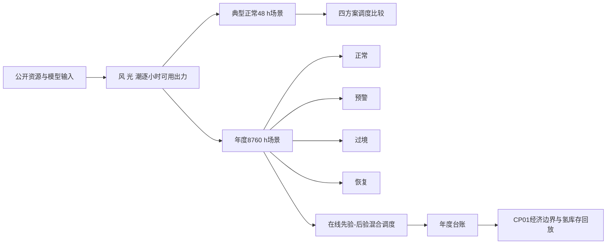
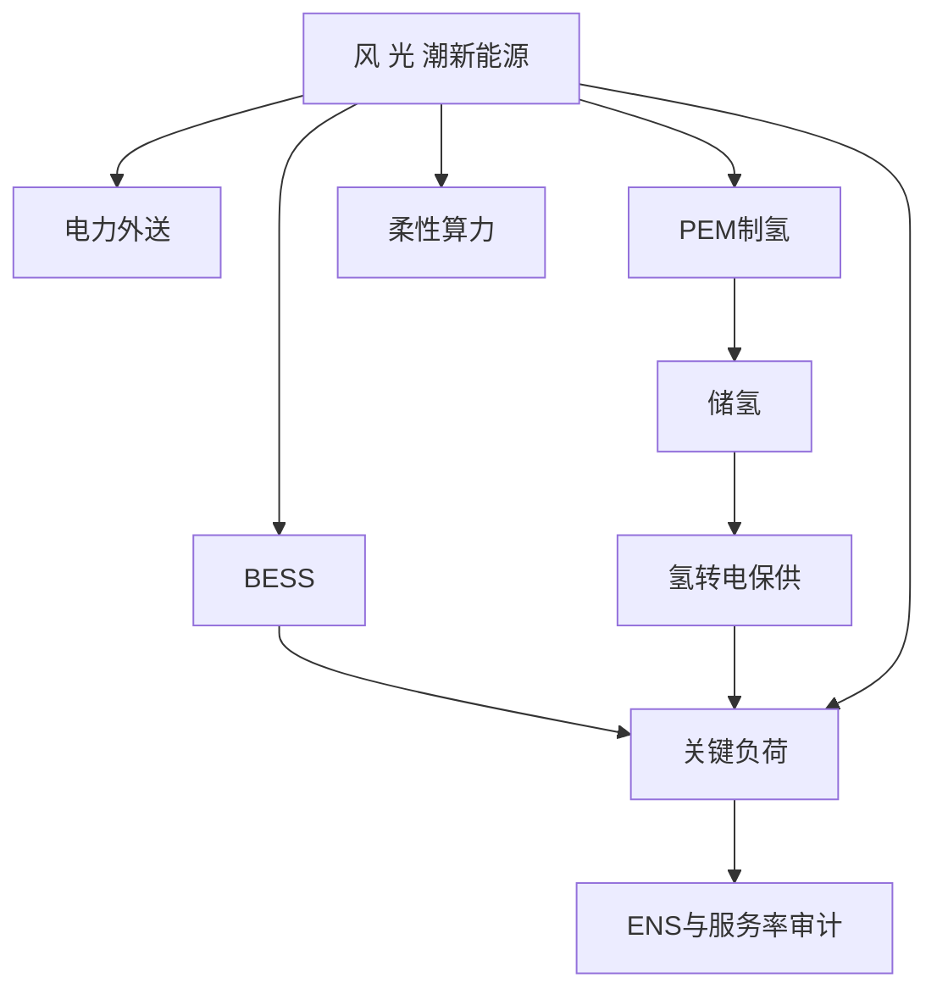
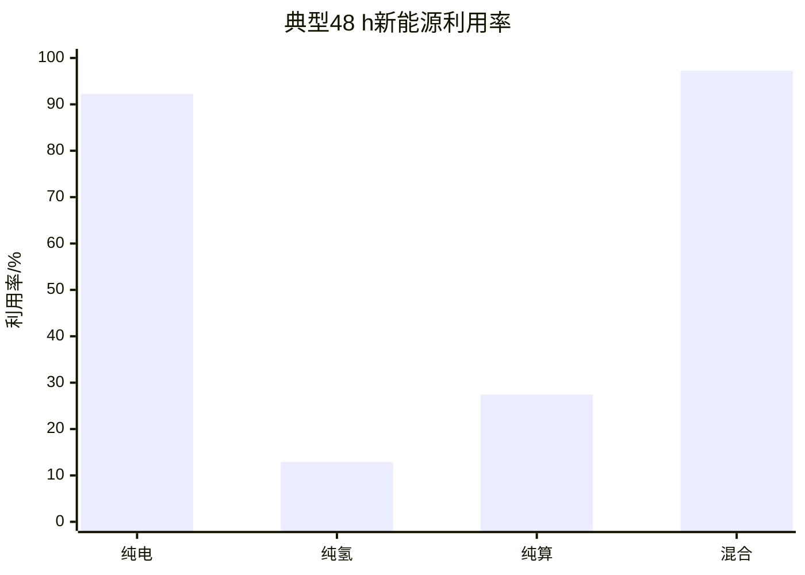
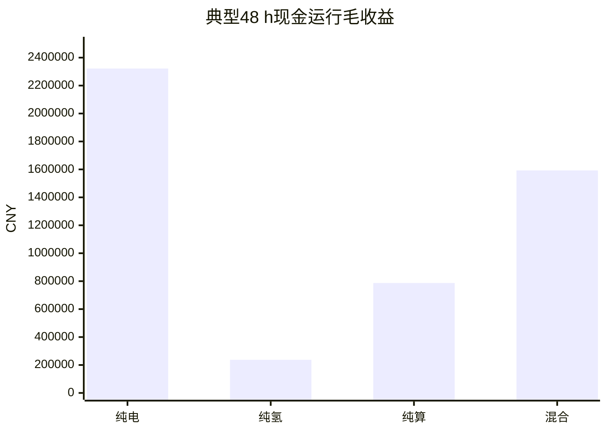
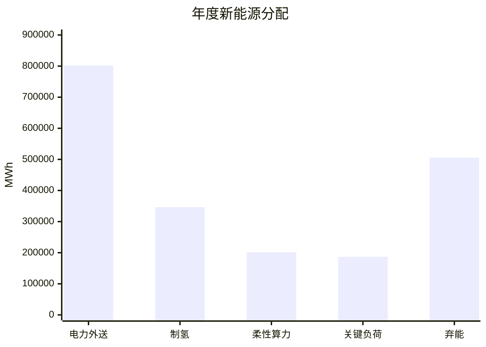
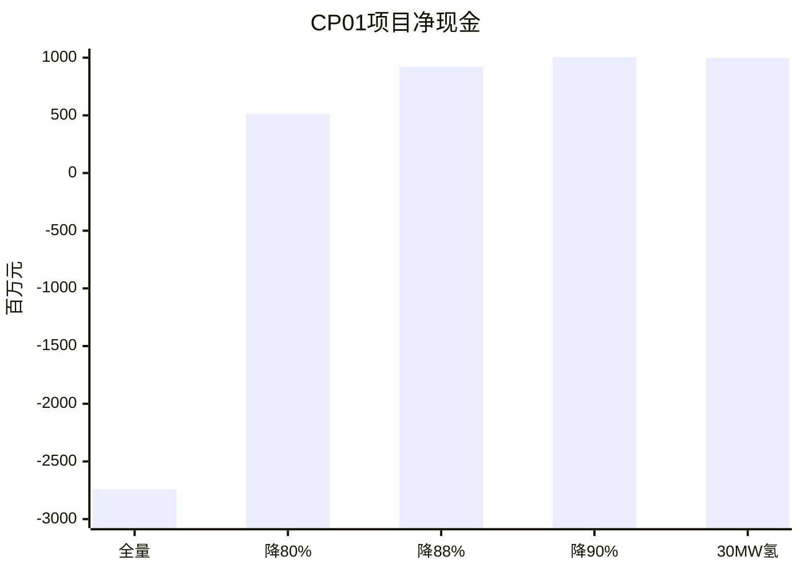
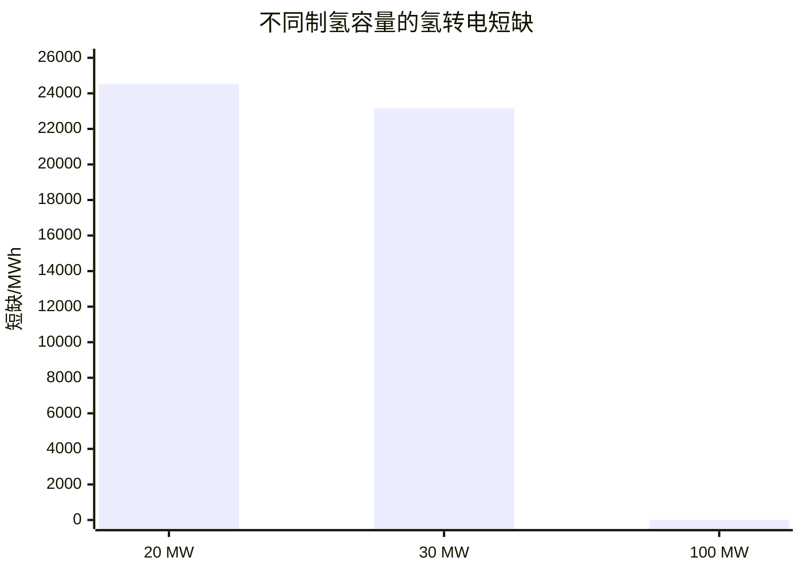

# 调度场景与多方案仿真结果分析

## 1. 分析范围

本报告只分析模型仿真结果，不将仿真结果直接解释为可研概算、融资承诺或投资决策。

报告回答两个问题：

1. 在统一场景和调度规则下，纯电、纯氢、纯算和电氢算混合旧方案的运行表现如何，哪一种方案更适合承担“调度最优”结论。
2. 在年度在线调度结果已经确定的前提下，CP01 项目层如何通过减轻资产负担和增加合同化收入实现收益转正。

需要区分三个结果层级：

| 结果层级 | 主要用途 | 当前仿真范围 |
|---|---|---|
| 典型正常场景 | 四种资产方案的可比调度比较 | 48 h |
| 年度在线策略 | 验证混合策略全年运行和极端事件响应 | 8,760 h |
| CP01 收益回放 | 在既有年度台账上分析项目经济边界 | 年度经济叠加 + 逐小时氢模块回放 |

CP01 当前程序复用已有年度在线调度台账，再进行经济叠加和氢库存回放。因此，CP01 结果是“既定调度策略下的项目层优化分析”，不是在全新资产边界下重新求解一套完整调度最优解。

## 2. 场景是如何搭建的

### 2.1 场景生成链路



### 2.2 系统边界

模型把新能源出力分配给多个出口：



其中：

- 电力外送、制氢、柔性算力属于可选产品通道；
- 关键负荷由新能源、BESS 和氢转电共同保障；
- 调度优先满足可靠性约束，再释放可选产品份额，最后优化经济性；
- 算力在当前比较中按可中断柔性负荷处理，不计入刚性 ENS；
- 期末氢库存可以作为状态量或资产估值，但不能直接等同于当年现金收入。

### 2.3 调度控制方式

在线混合策略采用先验—后验滚动调度：

1. 使用截至上一小时的风、光、潮实测信息形成先验；
2. 在 `6 h` 滚动窗口内形成电力、制氢和算力分配计划；
3. 只执行当前首小时；
4. 继承上一小时末 BESS、氢库存、电解槽和算力状态；
5. 遇到极端事件时，释放可选产品计划和部分储备目标，优先保证关键负荷。

典型正常 `48 h` 场景主要用于四方案的统一比较。年度 `8,760 h` 场景用于检验在线策略的连续状态继承、长期资源消纳和极端事件响应。

## 3. 四种方案的典型正常场景结果

### 3.1 综合指标对比

| 方案 | 新能源利用/MWh | 弃能/MWh | 新能源利用率 | 现金运行毛收益/CNY | 净运营价值/CNY | ENS/MWh |
|---|---:|---:|---:|---:|---:|---:|
| 纯电资产基准 | 7,796.323 | 654.475 | 92.255% | 2,321,848 | 2,343,709 | 0 |
| 纯氢资产基准 | 1,090.276 | 7,360.523 | 12.901% | 237,394 | 259,255 | 0 |
| 纯算资产基准 | 2,317.100 | 6,133.699 | 27.419% | 786,980 | 808,841 | 0 |
| 电氢算混合旧方案 | 8,218.290 | 232.508 | 97.249% | 1,592,760 | 2,639,345 | 0 |





### 3.2 纯电方案

纯电方案关闭制氢和柔性算力，只保留电力外送和相关储能边界。

- 新能源利用率达到 `92.255%`；
- 弃能为 `654.475 MWh`；
- 现金运行毛收益为 `2,321,848 CNY`，四种方案中最高；
- ENS 为 `0 MWh`；
- 运行逻辑简单，收入主要由电力外送产生。

该方案在短时正常场景下现金表现最好，但收益高度依赖电价、海缆利用率和送出资产成本。它不一定能够最大化新能源综合消纳，也不能单独体现制氢、算力和海洋服务的协同价值。

### 3.3 纯氢方案

纯氢方案关闭电力外送和柔性算力，只保留制氢、储氢和氢输出通道。

- 新能源利用率仅为 `12.901%`；
- 弃能为 `7,360.523 MWh`；
- 现金运行毛收益为 `237,394 CNY`；
- 当前 `1 h` 当前观测控制下未形成有效制氢投入；
- ENS 为 `0 MWh`，但主要是关键负荷仍得到保障，不代表氢业务形成了较强现金流。

该结果只能说明“纯氢资产 + 当前 `1 h` 控制口径”没有被选择，不能直接证明氢资产本身没有经济价值。正式结论应增加“纯氢资产 + 同一 `6 h` 滚动控制”的对照。

### 3.4 纯算方案

纯算方案关闭电力外送和制氢，将算力全部作为可中断柔性负荷。

- 新能源利用率为 `27.419%`；
- 弃能为 `6,133.699 MWh`；
- 算力服务量为 `1,148.243 MWh-CS`；
- 现金运行毛收益为 `786,980 CNY`；
- ENS 为 `0 MWh`。

纯算方案可以形成一定服务收入，但受算力任务池、服务价格、PUE 和客户利用率假设影响明显。当前结果不包含项目层 CAPEX、固定运维和融资负担。

### 3.5 电氢算混合旧方案

混合旧方案同时打开电力外送、制氢和柔性算力出口，并采用在线先验—后验滚动分配。

- 新能源利用率达到 `97.249%`，四种方案最高；
- 弃能仅为 `232.508 MWh`，四种方案最低；
- 电力、制氢、算力均获得非零分配；
- 现金运行毛收益为 `1,592,760 CNY`，低于纯电方案；
- 含期末氢库存估值的净运营价值为 `2,639,345 CNY`，高于纯电方案；
- ENS 为 `0 MWh`。

因此，混合旧方案更适合被定义为“综合消纳和多产品协同最优”，而纯电方案更适合被定义为“短时现金运行毛收益最优”。

### 3.6 调度最优结论

在“可靠性优先、再提高新能源利用率、最后比较经济性”的评价顺序下：

1. 四个方案在典型正常 `48 h` 场景中均实现 ENS 为 `0`；
2. 混合旧方案新能源利用率最高、弃能最低；
3. 纯电方案现金运行毛收益最高；
4. 混合旧方案的净运营价值最高，但该指标包含期末氢库存估值；
5. 因此不能使用单一指标宣布绝对最优，应写成“混合旧方案在综合消纳和多产品协同意义下最优，纯电方案在短时现金收益意义下最优”。

## 4. 年度在线混合策略结果

### 4.1 年度总体结果

| 指标 | 年度结果 |
|---|---:|
| 可用新能源 | 2,014,114.533 MWh |
| 新能源利用 | 1,508,548.282 MWh |
| 弃能 | 505,566.251 MWh |
| 新能源利用率 | 74.899% |
| 关键负荷需求 | 186,782.640 MWh |
| ENS | 2,248.455 MWh |
| 关键负荷服务率 | 98.796% |
| 电力外送投入 | 801,813.764 MWh |
| 制氢投入 | 346,498.437 MWh |
| 柔性算力投入 | 201,297.895 MWh |
| 产氢量 | 6,103,548.301 kg |
| 氢交付量 | 4,403,964.483 kg |
| 期末氢库存 | 43,991.458 kg |
| 氢转电电量 | 26,849.113 MWh |
| 算力服务量 | 187,398.643 MWh-CS |
| 已实现输出收入 | 1,404,610,577 CNY |
| 运行成本 | 92,142,294 CNY |
| 现金运行毛收益 | 1,312,468,283 CNY |



### 4.2 极端事件结果

| 阶段 | 小时 | 可用新能源/MWh | ENS/MWh | 关键负荷服务率 | 最低 SOC | 最低氢库存/kg |
|---|---:|---:|---:|---:|---:|---:|
| 正常 | 8,700 | 2,005,898.940 | 1,890.907 | 98.981% | 0.10625 | 0 |
| 预警 | 12 | 1,473.472 | 0 | 100.000% | 0.40787 | 0 |
| 过境 | 24 | 0 | 341.340 | 25.963% | 0.10625 | 0 |
| 恢复 | 24 | 6,742.121 | 16.209 | 96.815% | 0.10625 | 0 |

当前有效结果尚不能证明 `24 h` 零源出力代理事件下关键负荷零缺供。全年存在计划约束回退、储备目标回退和可靠性最小ENS层级，因此只能表述为“因果回退策略已完成年度运行并通过代数审计”，不能表述为“年度保供严格达标”。

## 5. CP01 收益转正仿真

### 5.1 运行层与项目层的区别

年度在线调度的现金运行毛收益为 `1,312.468 百万元/年`，但全量重资产方案的年化资本、固定运维、融资和替换负担达到 `4,054.611 百万元/年`。

因此：

```text
运行层：收入 - 运行成本 > 0
项目层：运行现金毛收益 - 年化资产负担 < 0
```

### 5.2 CP01 方案结果

| CP01方案 | 年化负担/百万元 | 收入/百万元 | 运行成本/百万元 | 项目净现金/百万元 | 覆盖倍数 | 经济判断 |
|---|---:|---:|---:|---:|---:|---|
| 全量重资产基准 | 4,054.611 | 1,404.611 | 92.142 | -2,742.143 | 0.324 | 不通过 |
| 年化负担下降80% | 810.922 | 1,354.517 | 30.501 | 513.094 | 1.633 | 通过 |
| 年化负担下降88% | 486.553 | 1,439.123 | 30.501 | 922.069 | 2.895 | 通过 |
| 年化负担下降90% | 405.461 | 1,439.123 | 30.501 | 1,003.161 | 3.474 | 通过 |
| 30 MW 制氢 + 35 CNY/kg + 负担下降88% | 486.553 | 1,528.192 | 46.644 | 994.994 | 3.045 | 经济上通过 |



### 5.3 制氢容量回放

| 电解槽上限/MW | 制氢用电/MWh | 产氢/kg | 交付/kg | 氢转电短缺/MWh | 期末库存/kg |
|---:|---:|---:|---:|---:|---:|
| 20 | 110,549.315 | 1,947,319.279 | 1,782,397.699 | 24,515.911 | 6,911.462 |
| 30 | 158,915.266 | 2,799,282.480 | 2,544,843.700 | 23,164.194 | 7,616.060 |
| 100 | 346,498.437 | 6,103,548.301 | 4,403,964.483 | 0.000 | 43,991.458 |



结论是：

- 20 MW 和 30 MW 模块化制氢可以改善经济性，但不能单独补足当前年度极端事件保供缺口；
- 100 MW 氢模块回放消除了氢转电短缺，但当前完整年度调度本身仍存在2,248.455 MWh ENS，不能直接当作保供达标证据；
- 因此 CP01 应将“经济门槛”和“可靠性门槛”分开验收。

## 6. 报告结论

1. 典型正常 `48 h` 场景中，纯电方案现金运行毛收益最高。
2. 混合旧方案新能源利用率最高、弃能最低，更适合作为综合调度最优方案。
3. 年度在线策略在当前假设下完成8,760 h因果运行并通过代数审计，但存在2,248.455 MWh ENS、计划约束回退和储备目标回退，年度结论不能写成零缺供。
4. CP01 的亏损主因不是运行成本，而是全量重资产带来的年化资本和固定负担。
5. 当项目实际承担的年化负担下降约 `80%` 以上时，年度项目净现金可以转正；下降 `88%` 至 `90%` 时形成更明显安全垫。
6. 30 MW 制氢方案在经济上可行，但仍不足以独立承担极端事件保供；需要更高制氢/储氢能力或等效外部备用。

## 7. 仿真结果文件

- [四方案汇总](../5.3对比方案与模型最优策略/results/typical_normal_48h_four_strategy/c5_typical48_four_strategy_summary.csv)
- [四方案逐小时台账](../5.3对比方案与模型最优策略/results/typical_normal_48h_four_strategy/c5_typical48_four_strategy_hourly.csv)
- [四方案事件汇总](../5.3对比方案与模型最优策略/results/typical_normal_48h_four_strategy/c5_typical48_four_strategy_event_summary.csv)
- [年度策略汇总](results/annual_8760h_online_strategy_extreme/c5_annual_online_strategy_summary.csv)
- [年度逐小时台账](results/annual_8760h_online_strategy_extreme/c5_annual_online_strategy_hourly.csv)
- [年度事件汇总](results/annual_8760h_online_strategy_extreme/c5_annual_online_strategy_event_summary.csv)
- [CP01经济方案汇总](results/cp01_profit_turnaround_simulation/cp01_profit_turnaround_scenarios.csv)
- [CP01氢模块回放](results/cp01_profit_turnaround_simulation/cp01_hydrogen_module_replay.csv)
- [CP01校核报告](results/cp01_profit_turnaround_simulation/cp01_profit_turnaround_simulation_checked_v2.md)


