# 第五章 方案验证与运营分析报告

## 本章摘要

本章用于说明三件事：第一，建立 2025 年 8,760 h 年度运行场景，并从年度正常运行时段中截取一个连续 48 h 样本用于短窗横向比较；第二，在同一场景下比较纯电、纯氢、纯算和在线混合策略的消纳、收益、碳代理和可靠性表现；第三，通过年度连续仿真和敏感性分析判断在线混合策略的运行优势与剩余风险。

本章结果属于模型仿真结果，不等同于可研概算、融资承诺或设备性能保证。电力外送价、氢价和算力服务价采用公开市场代理锚值，海洋服务价、容量、任务池、设备可用率、极端事件和控制参数仍需后续企业调研校准。当前年度基准只完成纯电资产基准，纯氢和纯算年度结果尚未补齐，因此年度部分只讨论“在线混合策略相对纯电基准”的改善幅度。

## 5.1 场景设计与数据来源

本章先说明模型在逐小时调度中使用哪些输入，再说明 48 h 短场景和 8,760 h 年度场景的构造方法。当前可用于比较的短窗为 48 h，并非 168 h 典型周；后续若需要典型周结果，应重新选取或生成 168 h 场景，并按同一口径复算。

### 5.1.1 输入数据结构

调度模型的输入分为资源、设备、负荷、市场、状态和事件六类：

| 输入类别 | 主要字段 | 当前来源或口径 | 状态 |
|---|---|---|---|
| 源侧资源 | 风速、辐照度、气温、潮流速度 | NASA POWER 小时风速/辐照度/气温；潮流速度由内部形状扩展 | NASA 为 **[政府官网/政府科研机构公开数据]**；潮流为 **[假设值，待企业调研校准]** |
| 设备容量 | 风电、海缆、电化学储能、电解槽、电氢转换、算力设施 | 第四章模型配置与本章场景参数 | **[假设值，待企业调研校准]** |
| 负荷需求 | 海洋关键负荷、柔性算力任务池 | C5 场景构造器 | **[假设值，待企业调研校准]** |
| 市场价格 | 电力外送价、氢价、算力服务价、海洋服务价 | 电力、氢和算力采用公开市场代理锚值；海洋服务价为待校准假设值 | 电/氢/算力为公开代理锚值，海洋服务价为假设值；均非项目合同价 |
| 初始状态 | 储能初始电量、氢库存、电解槽状态、算力状态 | 年度从储能初始电量 80 MWh、氢库存 0 kg 开始 | 不在事件前外部注入储能电量状态或氢 |
| 极端事件 | 台风预警、过境、恢复状态，设备降额 | 年度代理事件 | **[假设值，待企业调研校准]**，不是历史事件复刻 |

主比较口径下，算力全部作为可中断柔性负荷处理，未执行的算力任务不计入关键负荷缺供。若后续合同中包含不可中断服务承诺，应单独设置刚性算力敏感性场景，并与本章结果分开解释。

### 5.1.2 正常典型 48 h 场景设计

48 h 场景不是人工设定的压力测试，而是从 2025 年度正常运行序列中筛选出的连续样本。筛选规则是选择最接近年度正常状态中位特征的 48 h 窗口，特征包括可用新能源均值、波动性、风光潮分项出力和算力需求。当前选中的窗口为 2025-01-24 00:00 至 2025-01-25 23:00，48 个小时均处于正常运行状态。该窗口只用于短窗横向比较，不代表年度结论。

该 48 h 样本的可用新能源合计为 8,450.799 MWh。输入风况和负荷变化可分为四个阶段理解：

1. 第 1-12 小时为首日白天至傍晚，场景平均风速为 4.906-7.056 m/s，公开数据 50 m 风速为 5.960-8.480 m/s，辐照度从 669.670 Wh/m2 逐步降至夜间 0，潮流速度代理为 0.900-2.200 m/s。在线混合策略在这一阶段利用新能源 2,694.794 MWh，无弃能，主要用于电力外送、制氢和算力三类出口。

2. 第 13-24 小时为首日夜间，辐照度基本为 0，场景平均风速升至 5.637-8.072 m/s，潮流速度代理为 0.300-1.500 m/s。该阶段可用新能源为 1,689.987 MWh，全部被系统吸收，说明夜间仍依赖风电和潮流维持多出口调度。

3. 第 25-36 小时为次日白天，场景平均风速为 6.104-8.169 m/s，辐照度最高 665.650 Wh/m2，潮流速度代理为 0.300-0.800 m/s。该阶段可用新能源为 1,954.352 MWh，在线混合策略仍实现零弃能。

4. 第 37-48 小时为次日下午至夜间，公开数据 50 m 风速从 5.670 m/s 上升到 10.890 m/s，光照接近结束，潮流速度代理为 0.400-1.500 m/s。该阶段可用新能源为 2,111.666 MWh，其中 1,839.535 MWh 被利用，弃能 272.130 MWh，说明短窗弃能主要集中在最后一段高风速、低光照且出口约束趋紧的时段。

图 5-1 展示了该 48 h 样本的风速、风光潮可用功率和算力到达量，便于对应上文四个阶段。

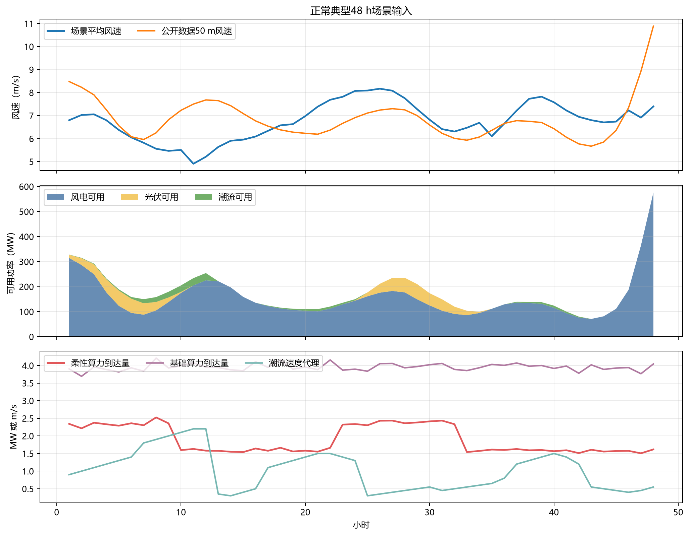

### 5.1.3 年度 8,760 h 场景设计

年度场景以 2025 年逐小时风、光、潮资源序列为基础，共 8,760 h。风、光、潮发电量由第四章设备模型结合逐时资源条件计算，不预设年度总发电量。年度序列中嵌入一个极端天气代理事件，用于检验系统在预警、过境和恢复阶段的连续运行能力。

年度仿真遵守以下因果边界：

1. 每小时只继承上一小时末的储能、氢库存、电解槽、算力和氢转电状态；

2. 计划窗口只执行首小时；

3. 源侧未来真实出力不进入计划；

4. 台风事件前不重置储能电量状态、不额外注入氢；

5. 氢库存只有物理非负约束，不设置运营储备下限；

6. 储能储备目标是可回退的调度约束，不代表模型外补能。

系统能流图若单独绘制，作用只是解释风、光、潮新能源如何进入电力外送、制氢、柔性算力、储能和关键负荷保供通道。它不是结果图，也不表达某一方案优于另一方案。本章正文后续直接用逐时调度图和结果柱状图解释各通道的实际运行表现。

## 5.2 基准方案设计：单一电力、氢与算力外送

三类基准方案均通过资产开关形成，不再沿用 22 种固定电力、氢和算力比例方案。各基准共同保留源侧新能源、电化学储能和海洋关键负荷，只改变可选产品出口。

| 基准方案 | 打开的可选产品通道 | 关闭的可选产品通道 | 设计目的 |
|---|---|---|---|
| 纯电资产基准 | 海缆外送 | 制氢、柔性算力 | 检验新能源直接外送电力的消纳和收益能力 |
| 纯氢资产基准 | 电解槽制氢、储氢、氢输出 | 海缆外送、柔性算力 | 检验氢链条在单一出口边界下是否承接波动电量 |
| 纯算资产基准 | 柔性算力 | 海缆外送、制氢 | 检验可中断算力负荷的吸纳和变现能力 |

这些基准不是固定比例分配，也不会强制可用新能源全部进入某一产品。模型仍按可靠性和经济性优化：若纯氢基准下制氢不经济，电解槽可以不启动；若纯算基准下任务池不足，剩余新能源可以弃电。因此，基准结果更准确的解释是“给定资产开关边界下的最优调度结果”，而不是“强制全电、全氢、全算”的结果。

阅读时请分两层：48 h 正常典型结果用于三基准横评；年度结果只用于“在线混合策略 vs 纯电基准”的压力对照。纯氢和纯算年度结果仍待补齐，因此本章不把年度三基准写成已完成结论。

## 5.3 对比方案与最优策略设计

对比方案围绕储能、制氢、算力和混合模式展开。第四章负责定义调度模型的目标函数、约束和求解边界；第五章负责把模型放入具体场景，说明策略规则、仿真过程和结果。因此，最优策略的数学机制可放在第四章，策略优劣和最终采用理由应在本章结合 48 h 与 8,760 h 结果讲清楚。

### 5.3.1 储能调度设计

电化学储能主要承担短时平滑、关键负荷保供和调度备用。仿真过程中记录充电、放电、储能电量状态、储备目标及储备目标回退情况。这里的储能储备目标是调度约束，不是硬性保供承诺；当储备目标与当前小时零缺供发生冲突时，模型优先满足当前关键负荷，并释放相应储备约束。

### 5.3.2 制氢与氢转电设计

制氢链条包括电解槽制氢、储氢、氢交付和氢转电。其中，制氢作为可选产品出口参与收益优化，氢转电作为关键负荷保供通道参与可靠性约束。当前年度主账不设置氢库存运营下限，氢库存仅受物理非负和容量约束；这样可以避免模型外注入氢，但也意味着台风事件前未必会自然形成足够的氢储备。

### 5.3.3 柔性算力设计

本章主比较中，算力按可中断柔性负荷处理，不计入关键负荷缺供。算力设施的价值不在于全年尽可能多耗电，而在于任务池和服务价格允许时，用相对高的单位电量收益吸收部分新能源。若未来项目承诺刚性服务承诺，则需要增设刚性算力负荷和违约惩罚场景。

### 5.3.4 在线混合最优策略

在线混合策略同时启用电力外送、制氢和柔性算力。每个小时先利用已发生的风、光、潮资源形成短期预测，再根据最新观测修正可用功率估计；随后在 6 h 滚动窗口内生成三类出口的分配计划，并只执行当前首小时。

结算层采用可靠性优先的分层逻辑：

1. 优先满足当前小时关键负荷零缺供、计划份额和储能储备目标；

2. 若不可行，释放可选产品计划份额；

3. 若仍不可行，释放储能和氢储备目标；

4. 若物理边界仍不能达到零缺供，则先求该小时最小缺供，并在最小缺供容差内优化经济性。

为减少相邻小时之间的分配跳变，三类出口份额经过平滑、保持和变化限幅处理。短期预测、防抖和限幅参数仍为待校准假设值，后续应通过企业运行数据进一步校准。

## 5.4 典型场景调度结果：48 h 与 8,760 h

本节不再把逐小时结果压缩成大表，而是用曲线和柱状图说明系统在短窗和年度尺度下的运行过程。关键数字在文字中列出，完整明细保留在结果台账中备查。

### 5.4.1 正常典型 48 h 四方案结果

四个方案使用同一正常 48 h 窗口，可用新能源均为 8,450.799 MWh，所有小时均求解成功并通过代数审计，关键负荷缺供为 0。图 5-2 展示在线混合策略在 48 h 内的逐小时表现：前 36 h 基本能够把可用新能源全部吸收，最后 12 h 出现 272.130 MWh 弃能；调度通道上，电力外送、制氢和柔性算力均被启用，储能主要承担平滑和保供状态维持。

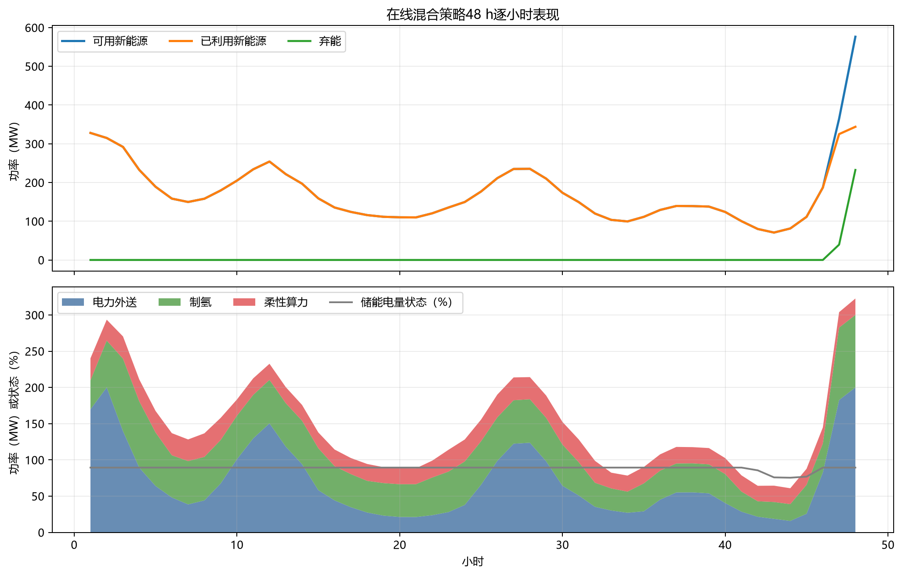

图 5-3 对四个方案做结果横比。在线混合策略在 48 h 内消纳率为 96.780%，高于纯电基准的 90.686%、纯算基准的 27.419% 和纯氢基准的 12.901%；其现金运行毛收益为 6.756 百万元，也高于纯算的 5.954 百万元、纯电的 2.533 百万元和纯氢的 0.237 百万元。在线混合策略实际投入结构为电力外送 47.189%、制氢 35.498%、柔性算力 17.313%，说明多出口组合提升了短窗消纳和收益表现。

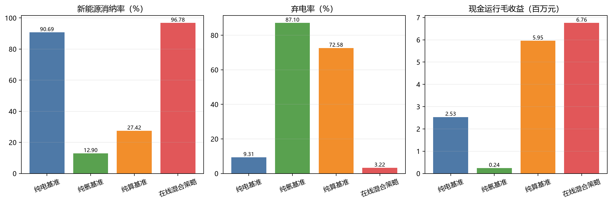

### 5.4.2 年度 8,760 h 结果

年度有效结果包括纯电基准和在线混合策略。由于年度纯氢、纯算基准尚未补齐，当前结果用于说明“在线混合策略相对纯电基准”的变化，不写成三类基准年度完整横评。全年可用新能源均为 2,014,114.533 MWh。在线混合策略利用 1,508,548.282 MWh，消纳率为 74.899%；纯电基准利用 1,211,294.279 MWh，消纳率为 60.140%。在线混合策略相对纯电基准减少弃能 297,254.003 MWh，并将现金运行毛收益从 369.822 百万元提高到 1,312.468 百万元。

图 5-4 展示在线混合策略的 8,760 h 逐小时运行轨迹。为便于阅读，图中使用 24 h 平滑曲线呈现全年变化，同时标出台风代理事件窗口。可以看到，年度收益和消纳改善主要来自正常运行时段的多出口吸收能力；极端事件窗口则主要暴露可靠性边界。

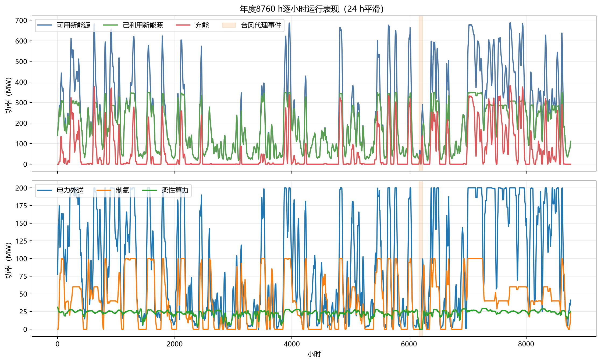

图 5-5 放大台风代理事件前后窗口。事件由 12 h 预警、24 h 过境和 24 h 恢复组成。年度在线混合策略在预警阶段无缺供；过境阶段由于源侧可用功率为 0，出现 341.340 MWh 缺供；恢复阶段源侧逐步恢复，仍有 16.209 MWh 缺供。该结果说明当前主账可以因果连续运行，但不能直接写成自然储氢即可保证极端天气下零缺供。

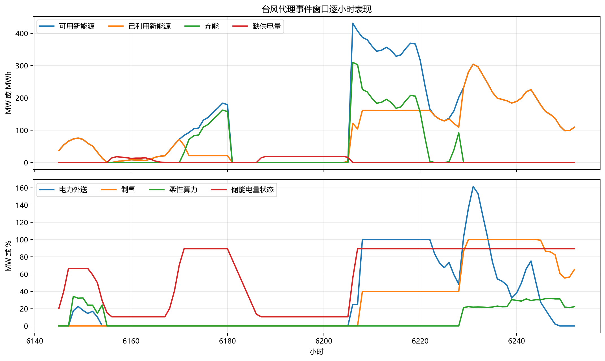

## 5.5 经济性、弃电率、碳减排和稳定性对比

本节在 5.4 逐时结果基础上做派生分析。经济指标仍不包含完整建设投资、固定运维、替换、税费和融资，因此只代表运行层面的现金毛收益。

### 5.5.1 经济性与弃电率

图 5-6 将 48 h 和年度结果分别画成柱状图。48 h 窗口中，在线混合策略同时取得最高消纳率和最高现金运行毛收益；年度口径下，在线混合策略相对纯电基准把弃电率从 39.860% 降到 25.101%，下降 14.759 个百分点。该结果支持“多出口协同提升新能源吸收和运行收益”的判断，但项目层收益仍需在包含建设投资和融资条件后单独测算。

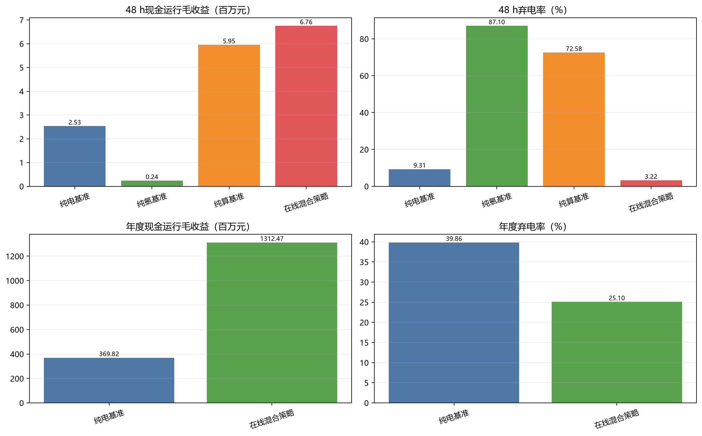

### 5.5.2 碳减排代理指标

碳减排代理采用统一口径计算：项目侧排放代理按新能源利用量和储能充放电吞吐量估计；避免排放代理按海缆受端电量、氢交付量和算力服务量估计；净碳代理等于项目侧排放代理减去避免排放代理。该指标只用于同一模型边界下的相对比较，不构成产品生命周期评价或碳足迹认证。

图 5-7 显示，48 h 短窗中纯电基准的净碳代理更优，主要原因是该窗口内直接电力外送量较高，且没有制氢和算力侧额外消纳。年度口径下，在线混合策略的净碳代理优于纯电基准，说明长周期内多产品交付带来的避免排放项更大。因此，碳减排排序不宜只依据单个短窗，应以年度连续结果作为主要判断依据。

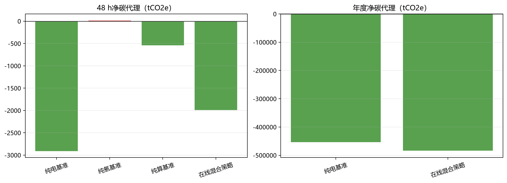

### 5.5.3 稳定性与可靠性

48 h 短窗中四个方案均为零缺供，说明在正常典型窗口内系统调度链路可以闭合。年度结果则不同：纯电基准缺供 2,544.630 MWh，在线混合策略缺供 2,248.455 MWh，二者都尚未达到年度严格零缺供。在线混合策略全年 8,760 个小时均完成求解并通过代数审计，但存在 359 h 计划回退、316 h 储备约束松弛和 154 h 可靠性层级放松，因此应表述为“可因果连续运行，但年度严格保供仍需进一步加强”。

## 5.6 离岸距离、电价、氢价与算力价格敏感性分析

本节把敏感性分析分成三类：一是只改变价格参数、保持调度结果不变的快速重估；二是只改变建设投资口径的生命周期台账重算；三是会改变可行域、必须重新跑全年的边界场景。这样写的目的，是避免把“重新计价”和“重新调度”混在一起解释。

### 5.6.1 离岸距离敏感性

离岸距离首先影响海缆和海纤的建设投资。以 200 km 作为基准时，年化投资负担为 3,670.660 百万元；距离缩短到 100 km 时，年化投资负担降至 3,596.987 百万元；距离增加到 300 km 时，年化投资负担升至 3,744.333 百万元。该结果只反映资本项变化，尚未代表所有海况、施工和可用率差异。

在已完成的“高海缆损耗”年度重跑中，年度海缆受端电量降至 705,468.049 MWh，弃能为 507,195.806 MWh，缺供电量为 2,238.658 MWh。该场景主要压缩受端电量和收入，对可靠性边界的影响相对有限。

### 5.6.2 电价、氢价和算力价格敏感度

在固定年度调度结果的前提下，电力外送价每提高 10 元/MWh，年度收入增加 7.377 百万元；氢价每提高 1 元/kg，年度收入增加 4.404 百万元；算力服务价格每提高一个设定步长，年度收入增加 18.740 百万元。由于这里没有重新求解调度，缺供、回退小时数和碳排放代理均保持不变。

### 5.6.3 全年边界重跑结果

会改变调度可行域的场景必须重新跑全年。当前已完成两组边界重跑：一组把柔性算力可用比例降至 50%，另一组提高海缆损耗代理。两组重跑均完成求解和代数审计，但都仍存在年度缺供，因此只能作为边界诊断，不能写成严格达标结论。

| 场景 | 关键变化 | 缺供电量/MWh | 输出收入/百万元 | 运行成本/百万元 | 现金运行毛收益/百万元 | 计划回退/h | 储备松弛/h | 可靠性放松/h | 关键负荷服务率 |
|---|---|---:|---:|---:|---:|---:|---:|---:|---:|
| 年度在线基准 | 基准主账 | 2,248.455 | 1,404.611 | 92.142 | 1,312.468 | 359 | 316 | 154 | 98.796% |
| 柔性算力减半 | 柔性算力比例降至 50% | 4,591.382 | 1,416.455 | 115.896 | 1,300.560 | 313 | 833 | 277 | 98.453% |
| 高海缆损耗 | 海缆损耗代理提高 | 2,238.658 | 1,391.054 | 91.729 | 1,299.325 | 359 | 312 | 154 | 98.801% |

从结果看，柔性算力减半会显著放大缺供和储备松弛，说明算力柔性是当前年度策略里最直接的可靠性缓冲。高海缆损耗场景主要降低受端电量和收入，全年受端电量比基准少 32.201 GWh，缺供变化不大。

### 5.6.4 图表化展示

图 5-8 和图 5-9 展示价格弹性。算力服务价格对应的收入斜率最大，说明在当前参数下，算力服务价格是在线混合策略最敏感的收入杠杆。

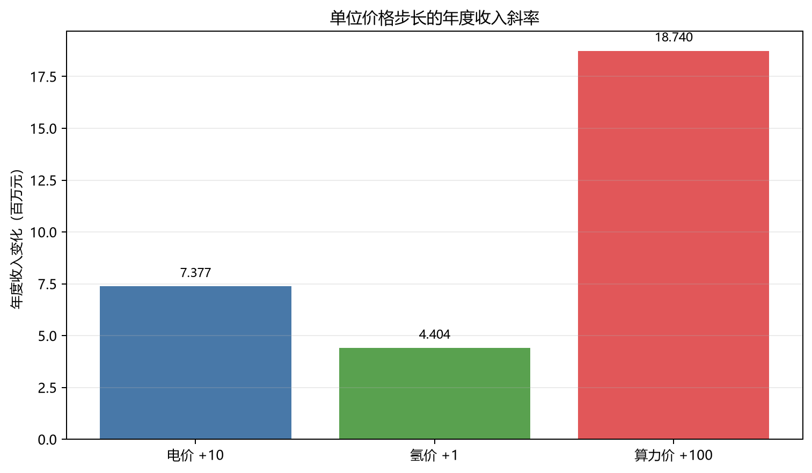

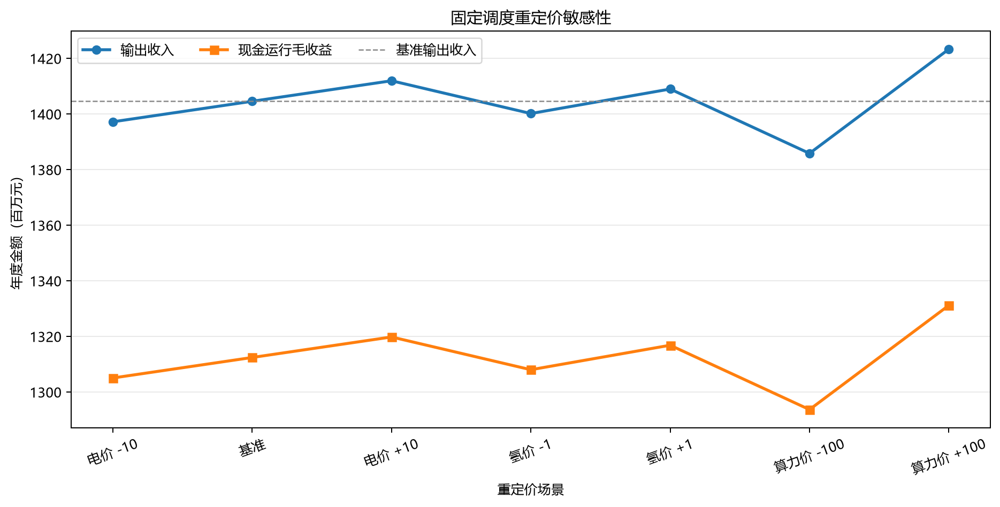

图 5-10 和图 5-11 展示建设投资和离岸距离影响。建设投资变化主要通过年化投资负担影响项目净现金，不会自动改变逐小时调度结果。

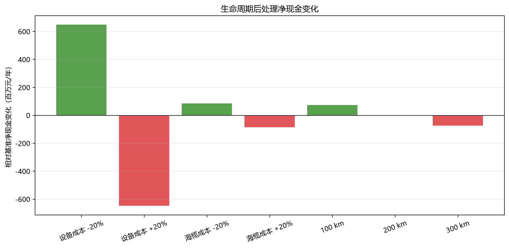

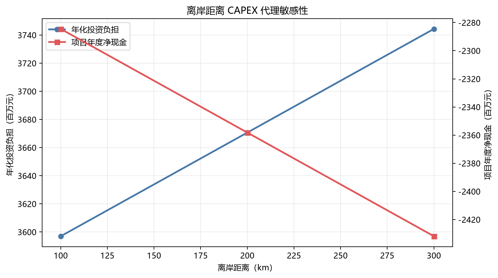

图 5-12 和图 5-13 展示会改变可行域的全年重跑结果，用于区分收益变化和可靠性边界变化。

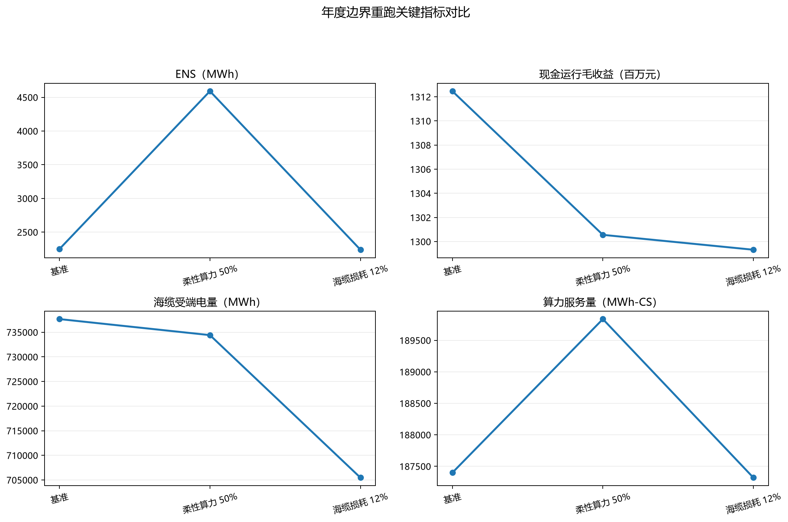

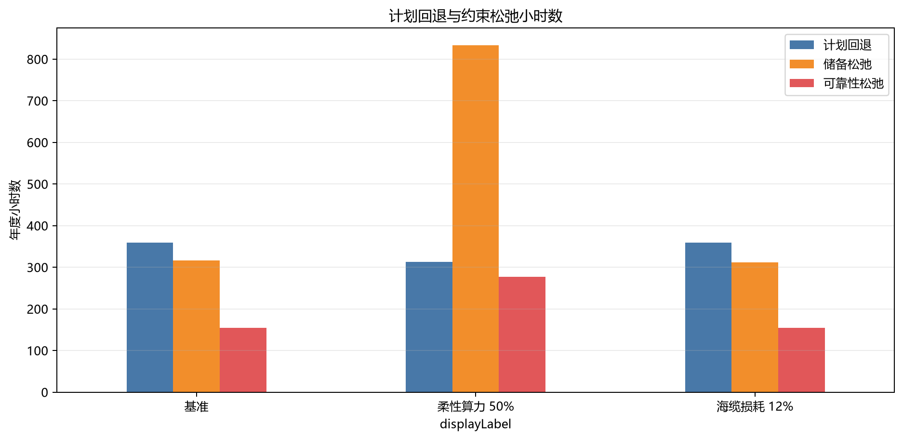

图 5-14 和图 5-15 展示逐时响应。累计现金曲线用于观察全年收益积累，事件窗口缺供曲线用于定位极端天气下的可靠性压力。

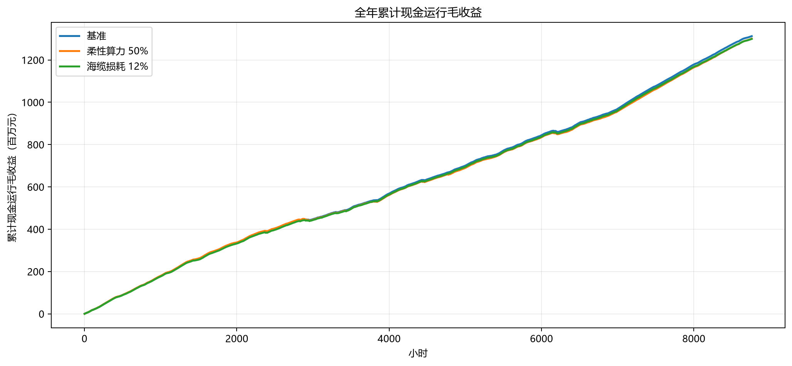

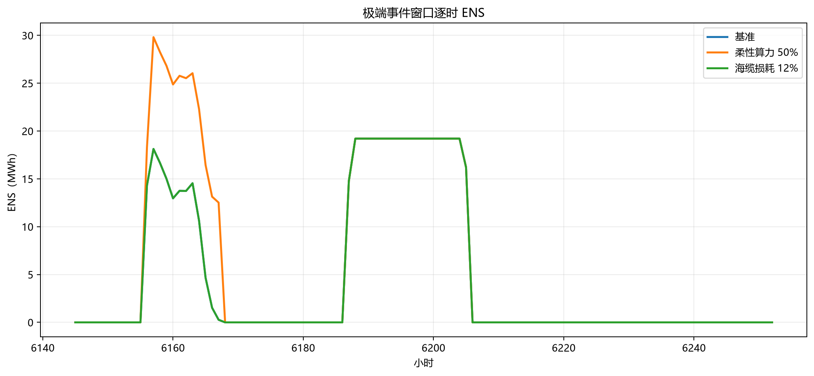

### 5.6.5 敏感性结论

价格参数适合先做固定调度重估，建设投资适合走生命周期台账，只有会改变可行域的边界假设才需要全年重跑。当前结果显示，算力服务价格是最大收入杠杆，柔性算力比例是更关键的可靠性杠杆，海缆损耗主要影响受端电量和收入。其余待补场景不写入正文结论，避免把待办内容误写成已完成证据。

## 5.7 本章仿真结论

本章的核心结论可以概括为四点。

第一，48 h 正常典型场景来自年度正常运行序列，不是人工压力测试。该窗口可用于比较四类方案在同一短窗内的调度差异，但不能直接外推为年度投资结论。

第二，在 48 h 正常窗口中，在线混合策略的消纳率为 96.780%，弃能为 272.130 MWh，现金运行毛收益为 6.756 百万元，整体优于三类单一出口基准。纯电基准消纳较高，纯算基准单位电量变现较强，纯氢基准在当前短窗价格和控制口径下启动不足。

第三，在年度口径下，在线混合策略相对纯电基准把新能源消纳率从 60.140% 提高到 74.899%，减少弃能 297,254.003 MWh，并增加现金运行毛收益 942.646 百万元。该结论只适用于“在线混合策略相对纯电基准”的年度对比，年度纯氢和纯算基准仍需补齐。

第四，年度可靠性仍是主要短板。在线混合策略全年均完成求解并通过代数审计，但年度缺供仍为 2,248.455 MWh；在 24 h 台风过境代理阶段，源侧可用功率为 0，并出现 341.340 MWh 缺供。因此，当前主账不能写成极端天气下严格零缺供，后续应把可靠性增强和项目层收益测算分开验收。

## 结果归档

本章正文只保留图表和关键结论；逐小时明细、敏感性处理表和边界重跑台账保留在仓库结果目录中，供复核和后续补算使用。
