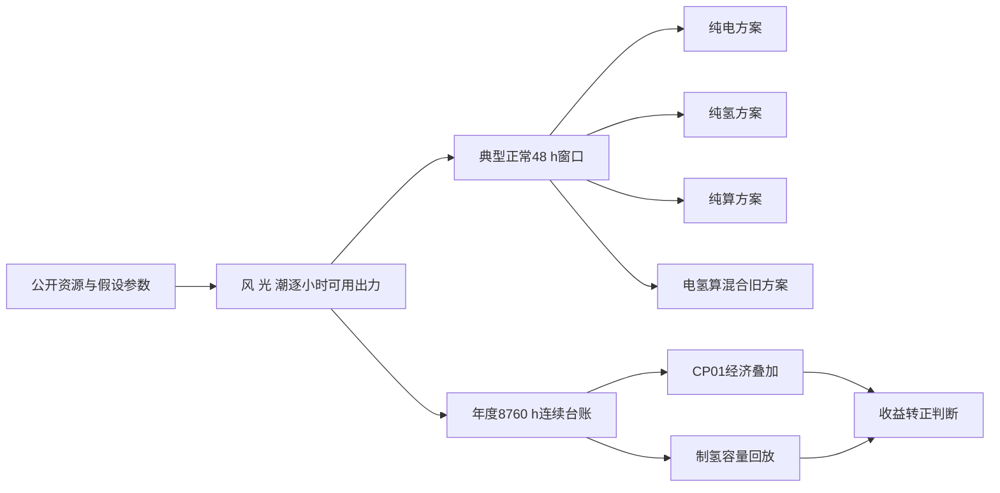
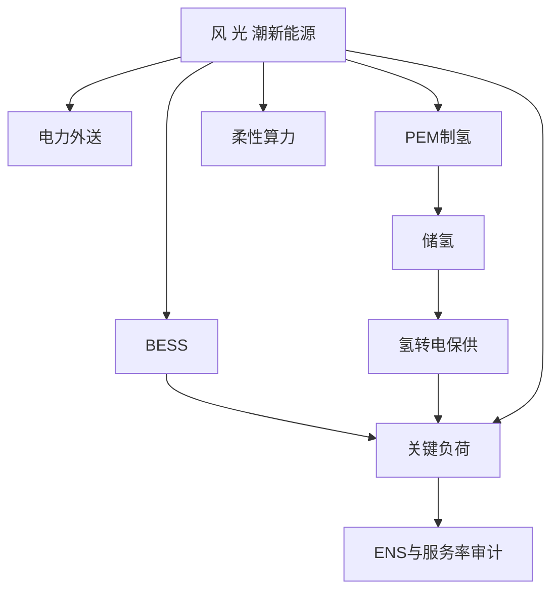
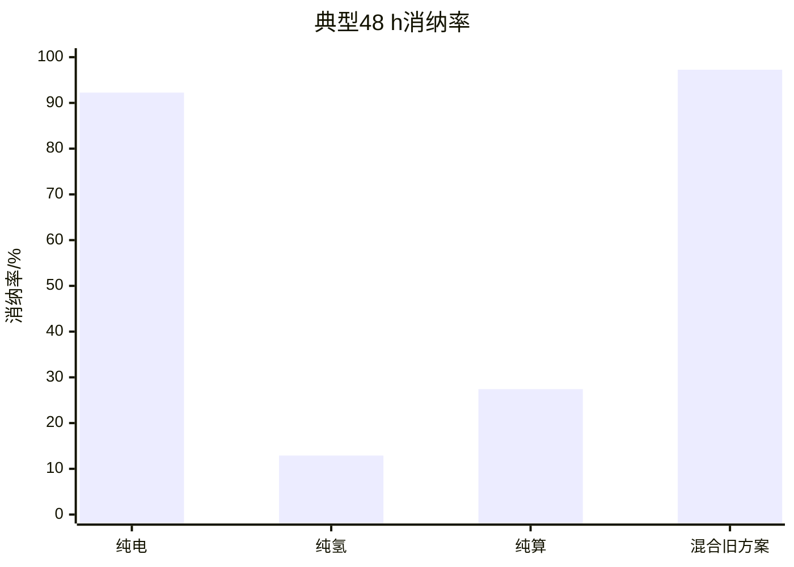
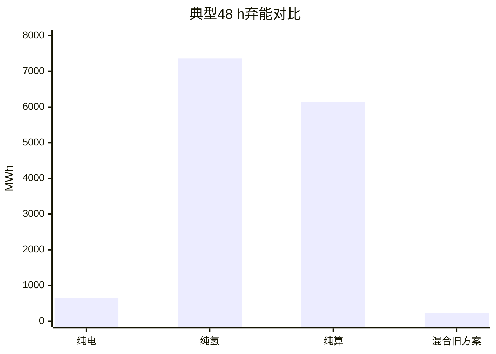
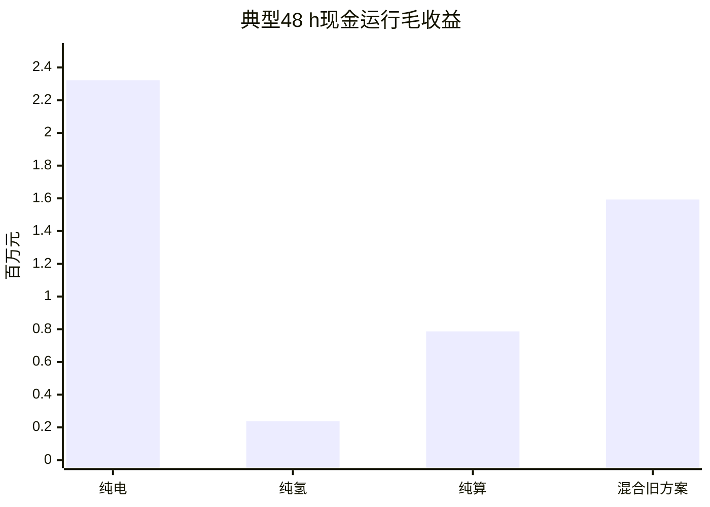
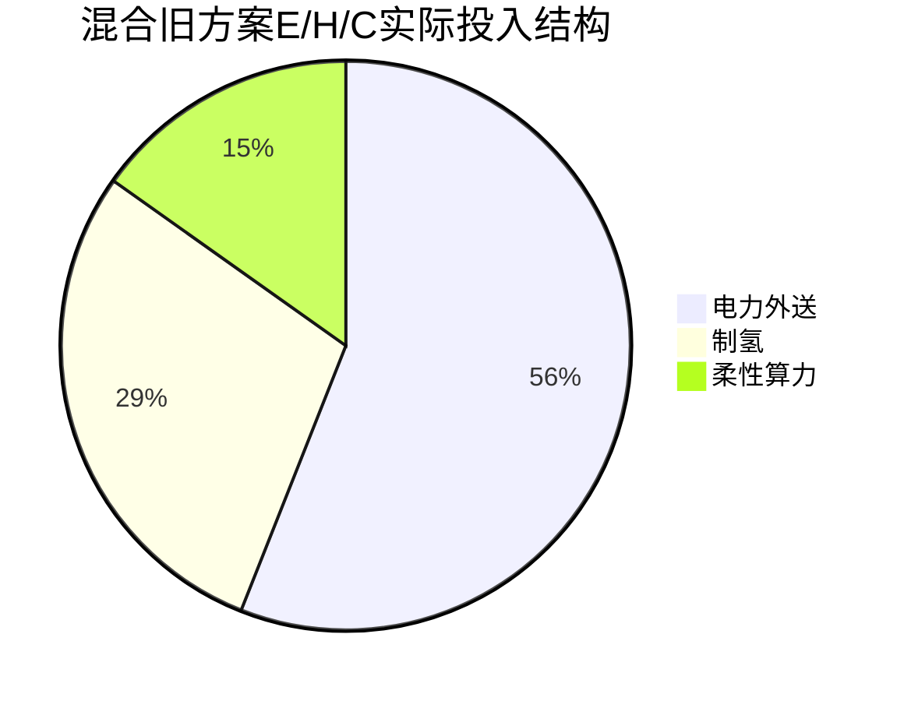
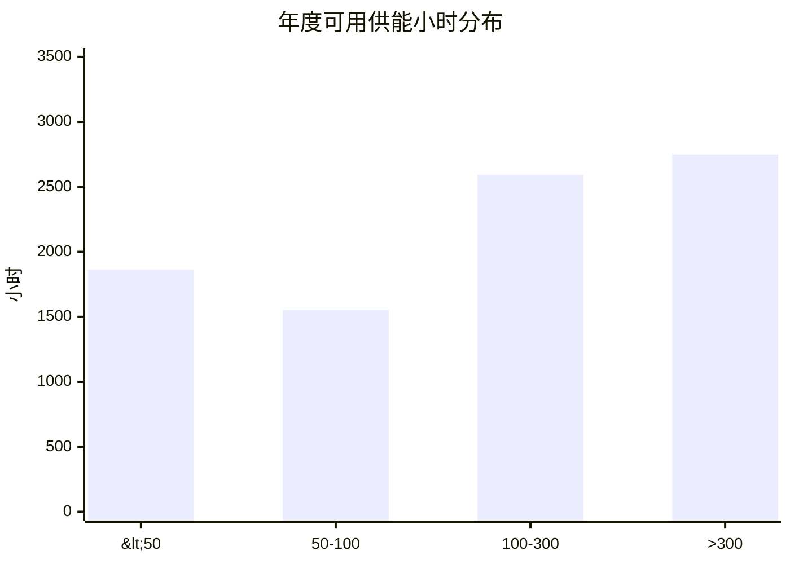
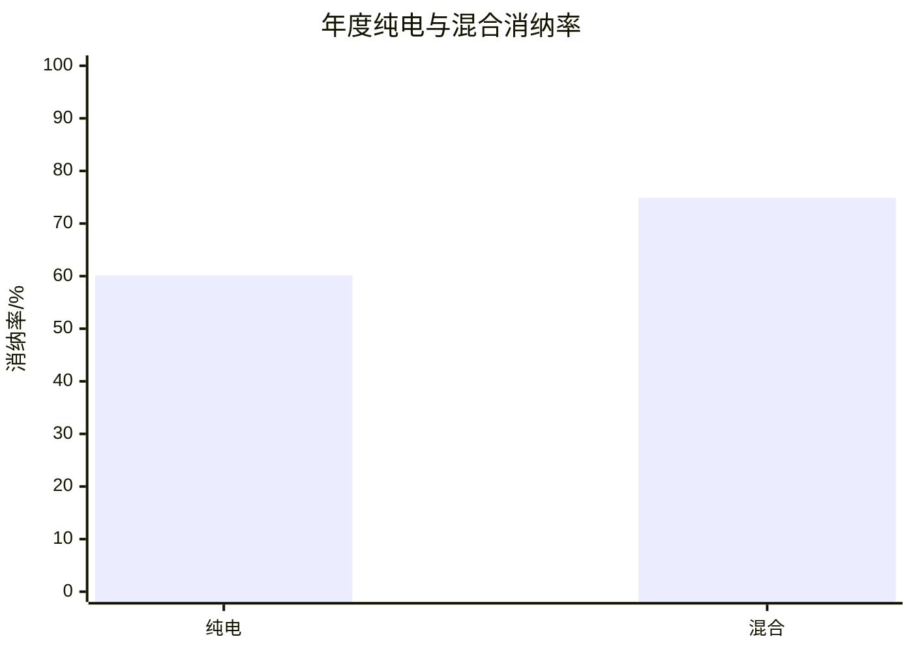
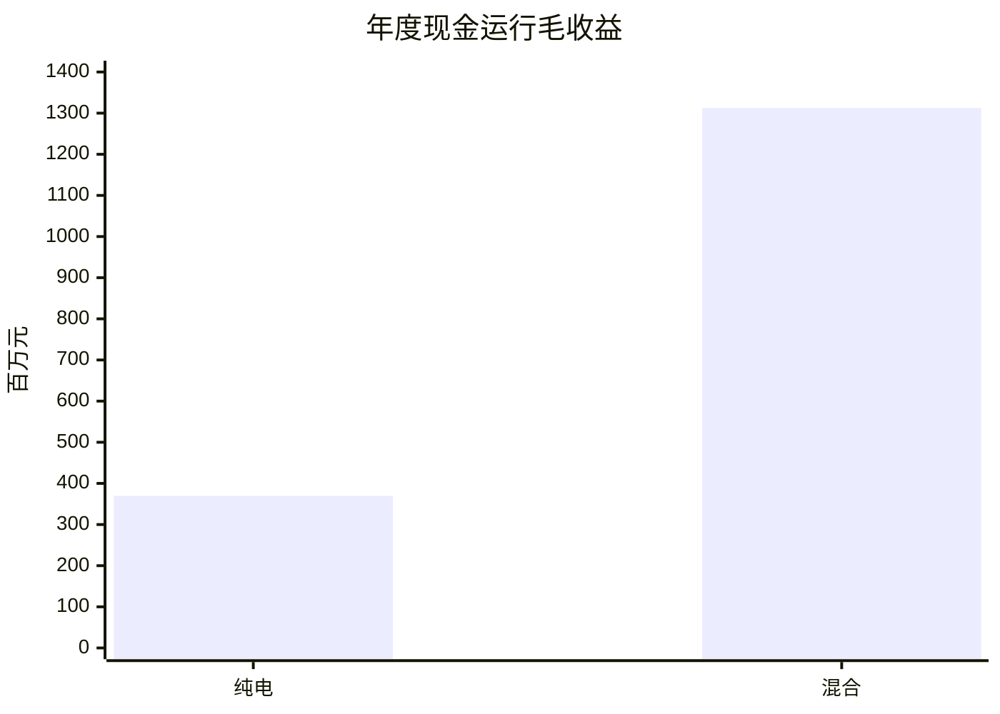
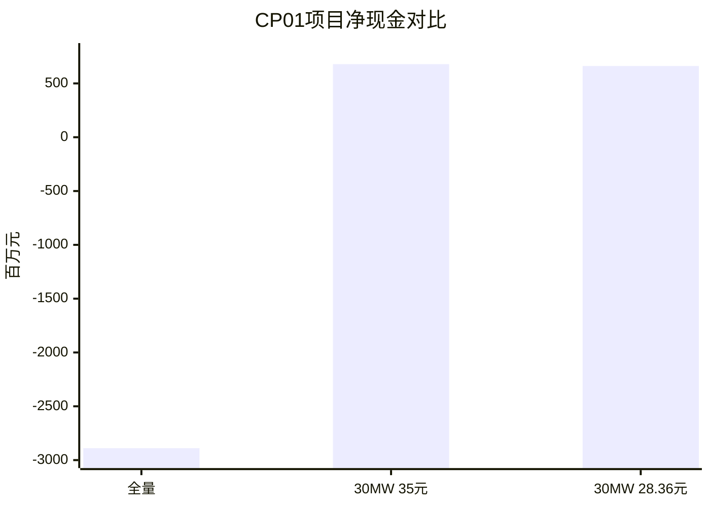

# 场景设计与四方案对比及收益转正分析

> 本文只分析仿真结果，不把结果直接解释为可研概算、融资承诺或投资决策。数字来源为当前仓库内 C5 仿真输出 CSV；输入含公开数据与假设参数，后续仍需企业报价、合同条款和实测数据校准。

## 1. 分析主线

本文分两层回答问题：

1. **场景设计与多个方案对比**：比较纯电、纯氢、纯算、电氢算混合旧方案，回答“哪个方案在调度意义下最优”。
2. **新方案收益转正分析**：在调度最优已经确定的前提下，只讨论 CP01 项目层如何通过轻资产边界和合同化收入把收益转正。

四方案对比回答的是**调度层最优**，CP01 新方案回答的是**项目层收益优化**。CP01 不是第五个调度方案，也不改变四方案比较中的调度排序。

## 2. 场景设计

### 2.1 测试场景怎么搭

仿真从风、光、潮逐小时可用出力出发，统一接入电力外送、制氢、柔性算力、BESS 和关键负荷保供边界。典型正常 `48 h` 用于横向方案比较；年度 `8,760 h` 台账用于 CP01 收益转正回放和极端事件边界说明。



### 2.2 系统边界

系统把新能源电量分配给五类去向：电力外送、PEM 制氢、柔性算力、BESS 充放电和关键负荷。关键负荷可靠性优先，其余产品通道在满足可靠性后按经济性和计划约束调度。



### 2.3 评价指标

| 指标 | 含义 | 用途 |
|---|---|---|
| ENS | 未供电量 | 先判断可靠性是否满足 |
| 新能源利用率 | 已利用新能源 / 可用新能源 | 判断消纳能力，也可写作消纳率 |
| 弃能 | 未被任何出口吸收的新能源 | 判断多通道吸收能力 |
| 现金运行毛收益 | 输出收入 - 运行成本 | 判断短期经营表现 |
| 项目净现金 | 现金毛收益 - 年化资产负担 | 判断项目层是否转正 |

## 3. 四种方案设置

| 方案 | 打开的产品通道 | 调度含义 |
|---|---|---|
| 纯电 | 电力外送 | 看新能源直接卖电的收益和消纳能力 |
| 纯氢 | 制氢、储氢、氢输出 | 看氢链条在单一出口下是否能承接波动电量 |
| 纯算 | 柔性算力 | 看可中断算力负荷吸收新能源的能力 |
| 电氢算混合旧方案 | 电力外送、制氢、柔性算力同时打开 | 看多产品协同调度的综合消纳能力 |

四方案使用同一个典型正常 `48 h` 场景，可用新能源均为 `8,450.799 MWh`。该场景不含台风等极端事件，主要用于方案横向比较。

## 4. 四方案仿真结果对比

### 4.1 总体指标

| 方案 | 新能源利用/MWh | 弃能/MWh | 消纳率 | 现金运行毛收益/百万元 | 净运营价值/百万元 | ENS/MWh |
|---|---:|---:|---:|---:|---:|---:|
| 纯电 | 7,796.323 | 654.475 | 92.255% | 2.322 | 2.344 | 0 |
| 纯氢 | 1,090.276 | 7,360.523 | 12.901% | 0.237 | 0.259 | 0 |
| 纯算 | 2,317.100 | 6,133.699 | 27.419% | 0.787 | 0.809 | 0 |
| 电氢算混合旧方案 | 8,218.290 | 232.508 | 97.249% | 1.593 | 2.639 | 0 |







### 4.2 分产品调度结果

| 方案 | 电力外送输入/MWh | 制氢输入/MWh | 算力服务/MWh-CS | 产氢/kg | 电缆受端电量/MWh |
|---|---:|---:|---:|---:|---:|
| 纯电 | 6,680.184 | 0.000 | 0.000 | 0.000 | 6,145.770 |
| 纯氢 | 0.000 | 0.000 | 0.000 | 0.000 | 0.000 |
| 纯算 | 0.000 | 0.000 | 1,148.243 | 0.000 | 0.000 |
| 电氢算混合旧方案 | 3,984.015 | 2,051.255 | 1,010.643 | 36,132.722 | 3,665.294 |

说明：纯氢方案的 `制氢输入=0` 和 `产氢=0` 不是录入错误。该基准只表示“电力外送和算力关闭、氢资产可用”，但没有强制制氢、没有期末氢库存收益，也没有氢交付刚性目标。在当前 `1 h` 当前观测控制口径下，优化器只满足关键负荷和 BESS 状态，未启动电解槽；因此该方案的 `1,090.276 MWh` 新能源利用主要来自关键负荷供电和首小时 BESS 充电，不是来自制氢。



### 4.3 方案表现解释

纯电方案在 `48 h` 场景中现金运行毛收益最高，为 `2.322 百万元`，说明短时正常场景下直接外送电力是最强现金收入通道。但纯电方案消纳率低于混合旧方案，且不能体现制氢和算力的协同价值。

纯氢方案消纳率只有 `12.901%`，弃能达到 `7,360.523 MWh`。需要特别说明，这里的“纯氢”不是“强制把可用电量都拿去制氢”，而是“只打开氢资产、关闭电力外送和算力”的资产开关基准；在没有制氢交付目标或库存终值约束时，电解槽没有被调度启动。因此该结果不能简单外推为“氢资产没有价值”，只能说明纯氢单出口在本测试设置下不适合作为调度最优方案。

纯算方案消纳率为 `27.419%`，现金运行毛收益为 `0.787 百万元`。它能形成一定服务收入，但受任务池规模、服务价格、PUE 和客户利用率假设影响明显，综合消纳能力不足。

电氢算混合旧方案消纳率达到 `97.249%`，弃能只有 `232.508 MWh`，是四方案中消纳能力最强的方案。它的现金运行毛收益低于纯电，但净运营价值最高，并且电力、制氢、算力均获得非零分配。

### 4.4 现实因素校核：不能只用理想短窗证明项目必要性

如果只看典型正常 `48 h`，纯电方案现金运行毛收益最高，且消纳率也已经达到 `92.255%`。这个结果不能硬写成“混合方案在任何口径下都绝对优于纯电”。更稳妥的写法是：典型短窗回答的是正常条件下的调度排序；项目必要性要放到全年资源波动、极端事件、送出约束、合同收入和设备可用率中再验证。

最新年度混合策略台账显示，全年供能波动明显大于典型 `48 h` 窗口：

| 指标 | 典型正常48 h | 年度8760 h |
|---|---:|---:|
| 可用新能源总量/MWh | 8,450.799 | 2,014,114.533 |
| 平均每小时可用/MWh | 176.058 | 229.922 |
| 标准差/MWh | 88.105 | 208.405 |
| 变异系数 | 50.04% | 90.64% |
| P10 每小时可用/MWh | 100.171 | 21.851 |
| P90 每小时可用/MWh | 254.104 | 601.670 |
| 最低每小时可用/MWh | 70.756 | 0.000 |
| 最大单小时跳变/MWh | 211.731 | 696.473 |



年度中有 `1,864 h` 的可用新能源低于 `50 MWh/h`，占全年 `21.28%`；低于 `100 MWh/h` 的时段达到 `3,417 h`，占 `39.01%`。典型 `48 h` 窗口最低可用新能源仍有 `70.756 MWh/h`，因此它没有覆盖年度低出力尾部和极端事件停供状态。

年度极端事件分相也说明，项目必要性不能只靠正常短窗现金收益来判断：

| 事件阶段 | 小时 | 可用新能源/MWh | 已利用新能源/MWh | 弃能/MWh | ENS/MWh | 关键负荷服务率 |
|---|---:|---:|---:|---:|---:|---:|
| NORMAL | 8,700 | 2,005,898.940 | 1,504,753.903 | 501,145.037 | 1,890.907 | 98.981% |
| TYPHOON_WARNING | 12 | 1,473.472 | 374.121 | 1,099.352 | 0.000 | 100.000% |
| TYPHOON_PASSAGE | 24 | 0.000 | 0.000 | 0.000 | 341.340 | 25.963% |
| TYPHOON_RECOVERY | 24 | 6,742.121 | 3,420.258 | 3,321.863 | 16.209 | 96.815% |

年度纯电基准补跑后，`8,760 h` 同台账对比结果如下：

| 指标 | 年度纯电 | 年度混合 | 混合相对纯电 |
|---|---:|---:|---:|
| 可用新能源/MWh | 2,014,114.533 | 2,014,114.533 | 0.000 |
| 已利用新能源/MWh | 1,211,294.279 | 1,508,548.282 | +297,254.003 |
| 消纳率 | 60.140% | 74.899% | +14.759 个百分点 |
| 弃能/MWh | 802,820.255 | 505,566.251 | -297,254.003 |
| ENS/MWh | 2,544.630 | 2,248.455 | -296.175 |
| 关键负荷服务率 | 98.638% | 98.796% | +0.159 个百分点 |
| 输出收入/百万元 | 425.458 | 1,404.611 | +979.153 |
| 运行成本/百万元 | 55.635 | 92.142 | +36.507 |
| 现金运行毛收益/百万元 | 369.822 | 1,312.468 | +942.646 |





| 方案 | 电力输入/MWh | 制氢输入/MWh | 算力输入/MWh | 产氢/kg |
|---|---:|---:|---:|---:|
| 年度纯电 | 1,026,111.830 | 0.000 | 0.000 | 0.000 |
| 年度混合 | 801,813.764 | 346,498.437 | 201,297.895 | 6,103,548.301 |

所以，`48 h` 典型正常场景下“纯电现金更高”的结论不能外推到全年。在最新 `8,760 h` 波动年景和极端事件口径下，混合策略相对年度纯电同时提高消纳、减少弃能，并显著提高运行层现金毛收益；这比典型短窗更能支撑项目必要性。但两种年度方案都为 `PASS_RELAXED` 且 ENS 不为 `0`，可靠性结论仍需单独优化。

## 5. 消纳率、净收益、成本构成与制氢口径汇总

| 口径 | 结论 | 关键数字 |
|---|---|---|
| 消纳率 | 仓内可直接写成“新能源利用率” | 48 h 四方案分别为纯电 `92.255%`、纯氢 `12.901%`、纯算 `27.419%`、混合旧方案 `97.249%`；年度纯电 `60.140%`、年度混合 `74.899%`，混合提高 `14.759` 个百分点 |
| 运行层净收益 | 年度纯电和年度混合运行层均为正，年度混合更高 | 年度纯电收入 `425.458 百万元`、成本 `55.635 百万元`、现金毛收益 `369.822 百万元`；年度混合收入 `1,404.611 百万元`、成本 `92.142 百万元`、现金毛收益 `1,312.468 百万元` |
| 项目层净收益 | 全量重资产为负，轻资产/合同化后转正 | 按CP01真年度现金毛收益，全量重资产项目净现金 `-2,888.981 百万元`；年化负担降 80% 后 `354.708 百万元`；降 88% 后 `679.077 百万元`；降 90% 后 `760.169 百万元`；固定调度按28.36 CNY/kg重价后仍为 `661.659 百万元` |
| 成本构成 | 最新 CSV 可直接引用总成本和项目年化负担，旧 md 里的细项拆分不作为最终证据 | 年度混合运行成本比纯电增加 `36.507 百万元`，但现金毛收益增加 `942.646 百万元`；全量重资产年化负担 `4,054.611 百万元`；源侧运维、制氢变量、管输、启停等细项需以后续同口径成本分解 CSV 为准 |
| 制氢是否保留 | 年度混合调度里制氢仍在；CP01 一期可不保留，二期再加回 | 在线主账制氢投入 `346,498.437 MWh`、产氢 `6,103,548 kg`、交付 `4,403,964 kg`；CP01真年度30 MW PEM制氢投入 `150,424.301 MWh`、产氢 `2,649,715 kg`、交付 `2,623,218 kg` |

制氢结论要分开写：年度混合调度里制氢链条仍在运行；CP01 一期轻资产边界可以暂不保留制氢/储氢，但不能继承原年度极端事件保供证据。二期`30 MW PEM + 35 CNY/kg`真年度经济上通过，项目净现金为`679.077 百万元`；但ENS为`7,107.270 MWh`，若要保留完整保供边界，仍需更高制氢/储氢/氢转电配置或等效外部备用并重新复算。

## 6. 对“调度最优”的回答

四方案都实现了典型正常 `48 h` 场景下的 `ENS=0`，因此可靠性在该短场景中不是区分项。真正拉开差距的是新能源消纳、弃能和多产品协同能力。

| 判断口径 | 最优方案 | 依据 |
|---|---|---|
| 可靠性口径 | 四方案并列 | 典型正常 `48 h` 中 ENS 均为 `0` |
| 新能源消纳口径 | 电氢算混合旧方案 | 消纳率 `97.249%`，弃能 `232.508 MWh` |
| 短时现金毛收益口径 | 纯电 | 现金运行毛收益 `2.322 百万元` |
| 净运营价值口径 | 电氢算混合旧方案 | 净运营价值 `2.639 百万元`，但含期末状态价值 |
| 多产品协同口径 | 电氢算混合旧方案 | 电、氢、算三类出口均被调度使用 |

因此，建议写成：

> 在可靠性优先、综合消纳和多产品协同的调度评价口径下，电氢算混合旧方案是当前四方案中的调度最优方案；如果只看典型 `48 h` 的现金运行毛收益，则纯电方案最优。二者回答的问题不同，不能用纯现金毛收益否定混合方案的调度最优性。

## 7. 新方案：在调度最优前提下让收益转正

### 7.1 新方案定位

新方案不是重新证明“哪个调度方案最优”，而是在已经采用电氢算混合调度思路的前提下，解决项目层收益为负的问题。

```text
运行层：输出收入 - 运行成本 > 0
项目层：运行现金毛收益 - 年化资产负担
```

当前全量重资产边界的问题是：运行层现金毛收益为正，但年化资本、固定运维、融资和替换负担太重，项目层净现金被吞掉。

### 7.2 CP01 收益转正结果

| CP01方案 | 年化负担/百万元 | 收入/百万元 | 运行成本/百万元 | 现金毛收益/百万元 | 项目净现金/百万元 | 覆盖倍数 | 经济判断 |
|---|---:|---:|---:|---:|---:|---:|---|
| 全量重资产边界（按CP01真年度现金） | 4,054.611 | 1,296.187 | 130.557 | 1,165.630 | -2,888.981 | 0.287 | 不通过 |
| 30 MW PEM + 35 CNY/kg承购 + 负担下降88% | 486.553 | 1,296.187 | 130.557 | 1,165.630 | 679.077 | 2.396 | 经济上通过 |
| 同一固定调度按28.36 CNY/kg重价 | 486.553 | 1,278.769 | 130.557 | 1,148.212 | 661.659 | 2.360 | 经济上通过 |



### 7.3 新方案为什么能转正

新方案的转正逻辑不是单纯涨价，也不是换一个调度算法，而是把项目边界从“全量重资产自建”改成“轻资产 + 合同化 + 分阶段扩容”。

| 优化动作 | 对收益的影响 |
|---|---|
| 降低项目实际承担年化负担 | 直接减少资本、固定运维、融资和替换压力 |
| 电力收入合同化 | 通过 PPA、绿电溢价、容量或辅助服务收入提高收入确定性 |
| 算力改为客户自持或容量租约 | 避免项目方承担全量 IT 设备和替换成本 |
| 海洋服务收费 | 把关键负荷保供和应急韧性从免费约束改成服务收入 |
| 氢业务按实际交付确认收入 | 避免把期末库存估值误写成现金回款 |
| 制氢模块化扩容 | 先用 20-30 MW 做经济试点，再按可靠性需求扩到更高容量 |

### 7.4 经济门槛和可靠性门槛要分开

30 MW 制氢方案在经济上可以转正，但不能直接承担全部保供结论。最新CP01真年度已经显示30 MW PEM下ENS为`7,107.270 MWh`；下表旧在线台账氢模块回放仅作为容量敏感性参考，不能替代真年度重跑。

| 电解槽上限/MW | 制氢用电/MWh | 产氢/kg | 交付/kg | 氢转电/MWh | 氢转电短缺/MWh | 期末库存/kg |
|---:|---:|---:|---:|---:|---:|---:|
| 20 | 110,549.315 | 1,947,319.279 | 1,782,397.699 | 2,333.202 | 24,515.911 | 6,911.462 |
| 30 | 158,915.266 | 2,799,282.480 | 2,544,843.700 | 3,684.919 | 23,164.194 | 7,616.060 |
| 100 | 346,498.437 | 6,103,548.301 | 4,403,964.483 | 26,849.113 | 0.000 | 43,991.458 |

## 8. 最终结论

1. 典型正常 `48 h` 四方案比较中，电氢算混合旧方案消纳率最高、弃能最低，适合承担“正常短窗下综合调度最优”结论。
2. 纯电方案现金运行毛收益最高，适合承担“正常短窗下现金收益最优”结论，但不等同于全年现实波动下的综合最优。
3. 纯氢和纯算在当前测试设置下消纳能力不足，不能作为调度最优主方案。
4. 年度纯电基准已补跑。`8,760 h` 同台账下，混合方案相对纯电提高消纳率 `14.759` 个百分点、减少弃能 `297,254.003 MWh`、增加现金运行毛收益 `942.646 百万元`，更能支撑项目必要性。
5. CP01 新方案属于项目层优化：在调度最优思路不变的前提下，通过降低年化资产负担、提高合同化收入和模块化制氢；最新真年度30 MW方案项目净现金为`679.077 百万元`，经济口径转正。
6. 收益转正不代表可靠性自动通过。在线策略主账为 `PASS_RELAXED`、ENS `2,248.455 MWh`；CP01真年度30 MW方案同为 `PASS_RELAXED`、ENS `7,107.270 MWh`，若要保留完整保供能力，需要更高制氢/储氢配置或等效外部备用。

## 9. 仿真结果文件

- [四方案汇总](5.3对比方案与模型最优策略/results/typical_normal_48h_four_strategy/c5_typical48_four_strategy_summary.csv)
- [四方案逐小时台账](5.3对比方案与模型最优策略/results/typical_normal_48h_four_strategy/c5_typical48_four_strategy_hourly.csv)
- [四方案事件汇总](5.3对比方案与模型最优策略/results/typical_normal_48h_four_strategy/c5_typical48_four_strategy_event_summary.csv)
- [年度纯电基准汇总](5.2三大基准方案/results/annual_asset_baselines_causal/c5_annual_four_strategy_summary.csv)
- [年度纯电基准逐小时台账](5.2三大基准方案/results/annual_asset_baselines_causal/c5_annual_four_strategy_hourly.csv)
- [年度纯电基准事件汇总](5.2三大基准方案/results/annual_asset_baselines_causal/c5_annual_four_strategy_event_summary.csv)
- [年度在线策略汇总](5.7混合最优策略短测试与年度运营分析/results/annual_8760h_online_strategy_extreme/c5_annual_online_strategy_summary.csv)
- [年度在线策略逐小时台账](5.7混合最优策略短测试与年度运营分析/results/annual_8760h_online_strategy_extreme/c5_annual_online_strategy_hourly.csv)
- [CP01真年度汇总](5.7混合最优策略短测试与年度运营分析/results/cp01_annual_8760h_true_simulation/cp01_annual_true_strategy_summary.csv)
- [CP01真年度28.36元/kg重价汇总](5.7混合最优策略短测试与年度运营分析/results/cp01_annual_8760h_true_simulation/cp01_annual_true_strategy_summary_h2_28p36_reprice.csv)
- [CP01旧经济叠加方案汇总](5.7混合最优策略短测试与年度运营分析/results/cp01_profit_turnaround_simulation/cp01_profit_turnaround_scenarios.csv)
- [CP01旧氢模块回放](5.7混合最优策略短测试与年度运营分析/results/cp01_profit_turnaround_simulation/cp01_hydrogen_module_replay.csv)
