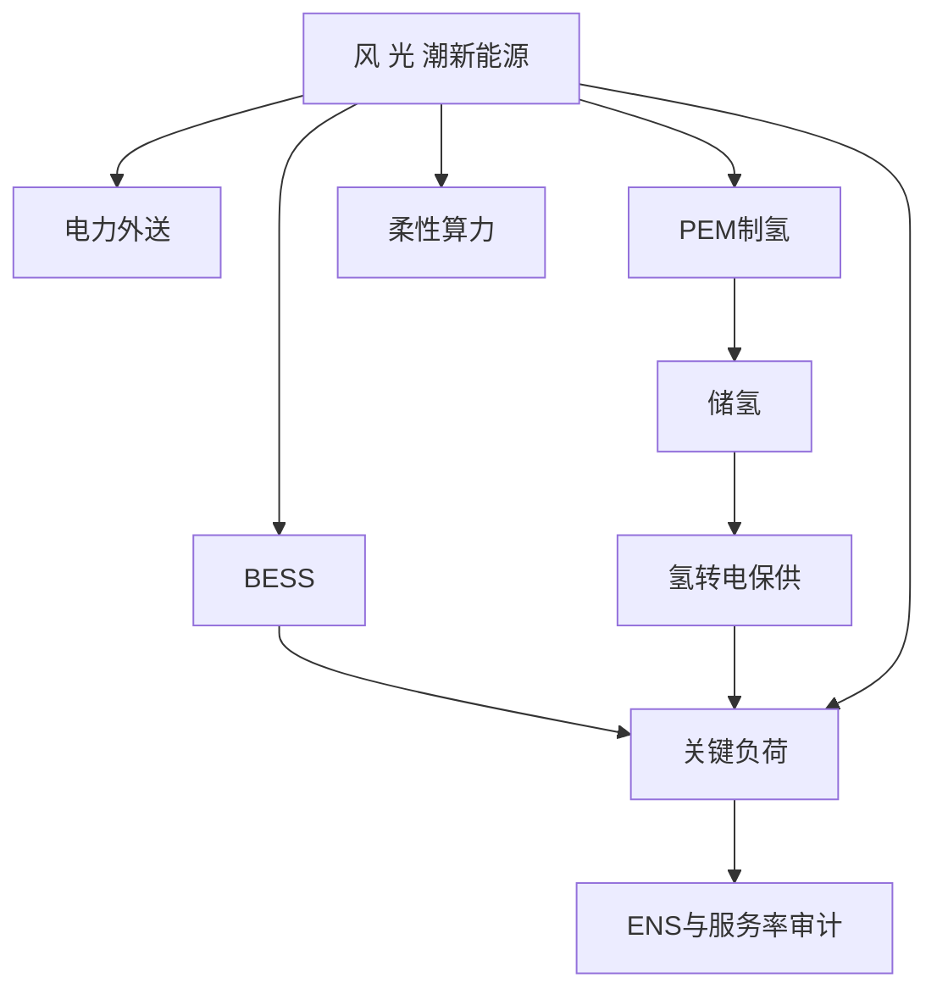
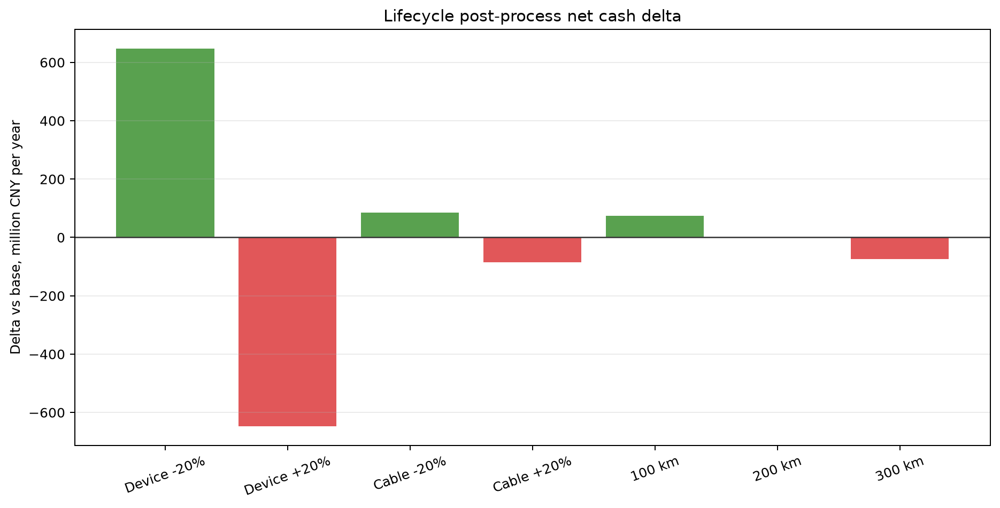
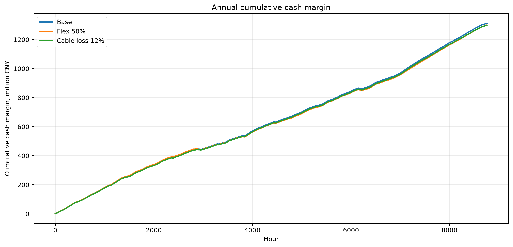
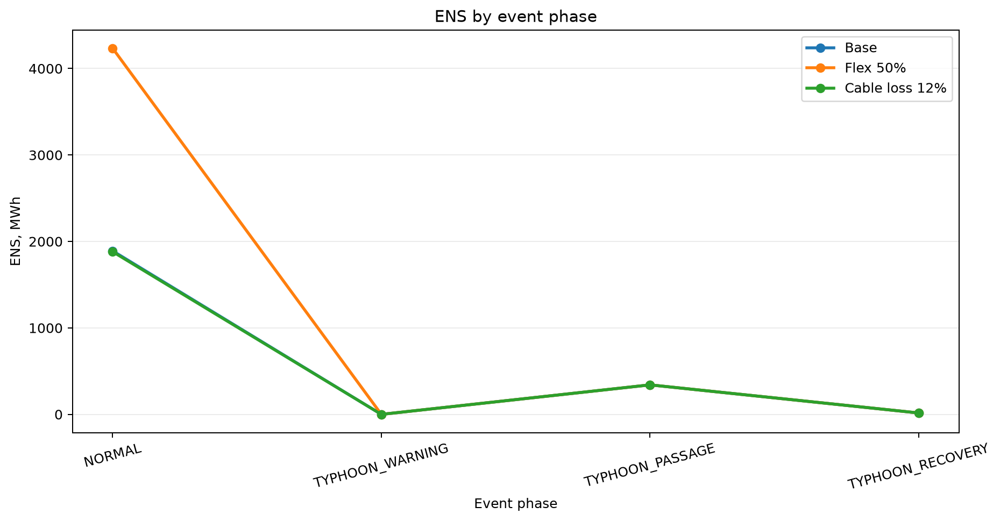

# 第五章 方案验证与运营分析报告

> 口径声明：本章基于当前仓库内 C5 已落盘的有效仿真结果展开分析。相关结果用于方案比较和运行机理判断，不等同于可研概算、融资承诺、投资收益承诺或设备性能保证。电力外送价、氢价和算力服务价采用公开市场代理锚值，尚非项目合同价；海洋服务价仍为 **[假设值，待企业调研校准]**。除已注明公开来源的数据外，容量、任务池、设备可用率、极端事件和控制参数均按 **[假设值，待企业调研校准]** 处理。文中仿真结果均为 **[模型仿真输出；输入含政府公开数据与假设参数]**。

## 5.1 场景设计与数据来源

本章先说明模型在逐小时调度中使用哪些输入，再说明 48 h 短场景和 8,760 h 年度场景的构造方法。当前可用于比较的短窗为 48 h，并非 168 h 典型周；后续若需要典型周结果，应重新选取或生成 168 h 场景，并按同一口径复算。

### 5.1.1 输入数据结构

调度模型的输入分为资源、设备、负荷、市场、状态和事件六类：

| 输入类别 | 主要字段 | 当前来源或口径 | 状态 |
|---|---|---|---|
| 源侧资源 | 风速、辐照度、气温、潮流速度 | NASA POWER 小时风速/辐照度/气温；潮流速度由内部形状扩展 | NASA 为 **[政府官网/政府科研机构公开数据]**；潮流为 **[假设值，待企业调研校准]** |
| 设备容量 | 风电、海缆、BESS、PEM、电氢转换、算力设施 | C4/V5 配置与 C5 场景参数 | **[假设值，待企业调研校准]** |
| 负荷需求 | 海洋关键负荷、柔性算力任务池 | C5 场景构造器 | **[假设值，待企业调研校准]** |
| 市场价格 | 电力外送价、氢价、算力服务价、海洋服务价 | 电力、氢和算力采用公开市场代理锚值；海洋服务价为待校准假设值 | 电/氢/算力为公开代理锚值，海洋服务价为假设值；均非项目合同价 |
| 初始状态 | BESS 初始电量、氢库存、电解槽状态、算力状态 | 年度从 BESS 80 MWh、氢库存 0 kg 开始 | 不在事件前外部注入 SOC 或氢 |
| 极端事件 | 台风预警、过境、恢复状态，设备降额 | 年度代理事件 | **[假设值，待企业调研校准]**，不是历史事件复刻 |

主比较口径下，算力全部作为可中断柔性负荷处理，`pComputeBaseDemandMW=0`，未执行的算力任务不计入刚性 ENS。若后续合同中包含不可中断 SLA，应单独设置刚性算力敏感性场景，并与本章结果分开解释。

### 5.1.2 48 h 场景设计

本章使用的 48 h 场景分为两类：

| 48 h 场景 | 构造方式 | 用途 | 是否参与方案排名 |
|---|---|---|---|
| 机制验证 48 h | `c5_build_all_channel_48h_scenario.m` 合成多阶段压力过程 | 验证风、光、潮接口，BESS/H2 状态转移，海缆、制氢、算力、海洋负荷通道和 V5 代数审计 | 否 |
| 正常典型 48 h | `c5_select_typical_normal_48h.m` 从年度正常候选窗口中离线选取 | 比较纯电、纯氢、纯算和在线混合策略 | 是 |

机制验证场景通过低出力、升出力、电价窗口、氢价窗口、算力窗口、海缆拥塞、BESS 回补和恢复等阶段，主动触发各类出口和状态变量。该场景主要用于确认模型链路能够闭合，不纳入经济性排序。

正常典型 48 h 从年度场景的正常候选窗口中选取，规则为“候选窗口相对正常状态中位特征向量的 MAD 距离最小”。当前窗口为 2025-01-24 00:00 至 2025-01-25 23:00 UTC，全部处于 `NORMAL` 状态。该窗口是离线评价样本，在线策略在滚动计划时并不读取窗口之后的真实源侧出力。

### 5.1.3 年度 8,760 h 场景设计

年度场景由 `c5_build_annual_2025_multisource_scenario.m` 生成逐小时风、光、潮可用功率，共 8,760 h。风、光、潮发电量由 4.3 设备模型结合逐时资源条件计算，不预设年度总发电量。年度序列中嵌入 12 h 台风预警、24 h 台风过境和 24 h 恢复代理事件。

年度仿真遵守以下因果边界：

1. 每小时只继承上一小时末 BESS、氢库存、电解槽、算力和氢转电状态；
2. 计划窗口只执行首小时；
3. 源侧未来真实出力不进入计划；
4. 台风事件前不重置 SOC、不额外注入氢；
5. 氢库存只有物理非负约束，不设置运营储备下限；
6. BESS 储备目标是可回退的调度约束，不代表模型外补能。

系统能量流如下：



## 5.2 基准方案设计：单一电力、氢与算力外送

三类基准方案均通过资产开关形成，不再沿用 22 种固定 E/H/C 比例方案。各基准共同保留源侧新能源、BESS 和海洋关键负荷，只改变可选产品出口。

| 基准方案 | 打开的可选产品通道 | 关闭的可选产品通道 | 设计目的 |
|---|---|---|---|
| 纯电资产基准 | 海缆外送 | 制氢、柔性算力 | 检验新能源直接外送电力的消纳和收益能力 |
| 纯氢资产基准 | PEM 制氢、储氢、氢输出 | 海缆外送、柔性算力 | 检验氢链条在单一出口边界下是否承接波动电量 |
| 纯算资产基准 | 柔性算力 | 海缆外送、制氢 | 检验可中断算力负荷的吸纳和变现能力 |

这些基准不是固定比例分配，也不会强制可用新能源全部进入某一产品。模型仍按可靠性和经济性优化：若纯氢基准下制氢不经济，电解槽可以不启动；若纯算基准下任务池不足，剩余新能源可以弃电。因此，基准结果更准确的解释是“给定资产开关边界下的最优调度结果”，而不是“强制全电、全氢、全算”的结果。

当前横向比较采用正常典型 48 h 结果。年度基准目前仅完成纯电资产基准一条，尚不足以支撑三类基准的年度完整对比。

## 5.3 对比方案与最优策略设计

对比方案围绕储能、制氢、算力和混合模式展开。本节先给出方案和策略设计，仿真结果在 5.4 节集中呈现。

### 5.3.1 储能调度设计

BESS 主要承担短时平滑、关键负荷保供和调度备用。仿真过程中记录充电、放电、SOC、储备目标及储备目标回退情况。这里的 BESS 储备目标是调度约束，不是硬性保供承诺；当储备目标与当前小时零 ENS 发生冲突时，模型优先满足当前关键负荷，并释放相应储备约束。

### 5.3.2 制氢与氢转电设计

制氢链条包括 PEM 制氢、储氢、氢交付和氢转电。其中，制氢作为可选产品出口参与收益优化，氢转电作为关键负荷保供通道参与可靠性约束。当前年度主账不设置氢库存运营下限，氢库存仅受物理非负和容量约束；这样可以避免模型外注入氢，但也意味着台风事件前未必会自然形成足够的氢储备。

### 5.3.3 柔性算力设计

本章主比较中，算力按可中断柔性负荷处理，不计入刚性 ENS。算力设施的价值不在于全年尽可能多耗电，而在于任务池和服务价格允许时，用相对高的单位电量收益吸收部分新能源。若未来项目承诺刚性 SLA，则需要增设刚性算力负荷和违约惩罚场景。

### 5.3.4 在线混合最优策略

在线混合策略同时启用电力外送、制氢和柔性算力。每个小时先用截至上一小时的风、光、潮实测形成先验，再通过动态后验修正源侧可用功率估计；随后在 6 h 滚动窗口内生成 E/H/C 计划，并只执行当前首小时。

结算层采用可靠性优先的分层逻辑：

1. 优先同时满足当前小时 `ENS=0`、计划份额和因果 SOC 储备目标；
2. 若不可行，释放可选产品计划份额；
3. 若仍不可行，释放 BESS/氢储备目标；
4. 若物理边界仍不能达到零 ENS，则先求该小时最小 ENS，并在最小 ENS 容差内优化经济性。

为减少相邻小时之间的分配跳变，E/H/C 份额计划经过指数平滑、死区保持和小时变化限幅处理。卡尔曼递推、协方差交集和防抖参数均用于在线策略；其中噪声比例、CI 权重、死区和限幅仍为 **[假设值，待企业调研校准]**。

## 5.4 典型场景调度结果：48 h 与 8,760 h

本节列示仿真直接输出。经济性、弃电率、碳减排和稳定性等派生分析放在 5.5 节。

### 5.4.1 正常典型 48 h 四方案结果

四个方案使用同一正常 48 h 窗口，可用新能源均为 8,450.799 MWh，且均满足 `auditPass=true`、`allHoursOptimal=true`，ENS 为 0。

| 方案 | 新能源利用/MWh | 弃能/MWh | 消纳率 | 现金运行毛收益/百万元 | 净运营价值/百万元 | ENS/MWh |
|---|---:|---:|---:|---:|---:|---:|
| 纯电资产基准 | 7,663.692 | 787.107 | 90.686% | 2.533 | 2.558 | 0 |
| 纯氢资产基准 | 1,090.276 | 7,360.523 | 12.901% | 0.237 | 0.263 | 0 |
| 纯算资产基准 | 2,317.100 | 6,133.699 | 27.419% | 5.954 | 5.979 | 0 |
| 在线混合策略 | 8,178.669 | 272.130 | 96.780% | 6.756 | 8.038 | 0 |

分产品调度结果如下：

| 方案 | 电力外送输入/MWh | 制氢输入/MWh | 柔性算力输入/MWh | 算力服务/MWh-CS | 产氢/kg | 海缆受端电量/MWh |
|---|---:|---:|---:|---:|---:|---:|
| 纯电资产基准 | 6,573.416 | 0.000 | 0.000 | 0.000 | 0.000 | 6,047.543 |
| 纯氢资产基准 | 0.000 | 0.000 | 0.000 | 0.000 | 0.000 | 0.000 |
| 纯算资产基准 | 0.000 | 0.000 | 1,226.824 | 1,148.243 | 0.000 | 0.000 |
| 在线混合策略 | 3,343.839 | 2,515.438 | 1,226.824 | 1,148.243 | 44,309.278 | 3,076.332 |

在线混合策略的实际可选投入比例为 47.189% / 35.498% / 17.313%，分别对应电力外送、制氢和柔性算力。在该 48 h 窗口内，富余再调度触发 2 h，额外吸收 64.586 MWh 用于制氢。

### 5.4.2 年度 8,760 h 结果

年度有效结果包括年度纯电基准和年度在线混合策略。由于年度纯氢、纯算基准尚未补齐，当前结果更适合用于“混合策略相对纯电基准”的对比，而不是三类基准的年度完整横评。

| 指标 | 年度纯电基准 | 年度在线混合策略 |
|---|---:|---:|
| 可用新能源/MWh | 2,014,114.533 | 2,014,114.533 |
| 新能源利用/MWh | 1,211,294.279 | 1,508,548.282 |
| 新能源利用率 | 60.140% | 74.899% |
| 弃能/MWh | 802,820.255 | 505,566.251 |
| ENS/MWh | 2,544.630 | 2,248.455 |
| 关键负荷服务率 | 98.638% | 98.796% |
| 电力外送投入/MWh | 1,026,111.830 | 801,813.764 |
| 制氢投入/MWh | 0.000 | 346,498.437 |
| 柔性算力投入/MWh | 0.000 | 201,297.895 |
| 产氢量/kg | 0.000 | 6,103,548.301 |
| 氢交付量/kg | 0.000 | 4,403,964.483 |
| 算力服务量/MWh-CS | 0.000 | 187,398.643 |
| 已实现输出收入/百万元 | 425.458 | 1,404.611 |
| 运行成本/百万元 | 55.635 | 92.142 |
| 现金运行毛收益/百万元 | 369.822 | 1,312.468 |

年度极端事件分相如下，表中为年度在线混合策略主账结果：

| 阶段 | 小时 | 可用新能源/MWh | 利用/MWh | 制氢投入/MWh | ENS/MWh | 最低 SOC | 最低氢库存/kg | 计划回退/h | 储备回退/h |
|---|---:|---:|---:|---:|---:|---:|---:|---:|---:|
| 正常 | 8,700 | 2,005,898.940 | 1,504,753.903 | 345,658.437 | 1,890.907 | 0.10625 | 0 | 352 | 294 |
| 预警 | 12 | 1,473.472 | 374.121 | 0 | 0 | 0.40787 | 0 | 0 | 2 |
| 过境 | 24 | 0 | 0 | 0 | 341.340 | 0.10625 | 0 | 0 | 18 |
| 恢复 | 24 | 6,742.121 | 3,420.258 | 840.000 | 16.209 | 0.10625 | 0 | 7 | 2 |

## 5.5 经济性、弃电率、碳减排和稳定性对比

本节在 5.4 直接结果的基础上做派生分析。除特别说明外，经济指标仍不包含完整 CAPEX、固定运维、替换、税费和融资。

### 5.5.1 经济性分析

48 h 短场景中，四个方案均实现 ENS 为 0，主要差异体现在消纳能力和运行收益上。在线混合策略的现金运行毛收益为 6.756 百万元，高于纯算的 5.954 百万元和纯电的 2.533 百万元；纯氢方案在该控制口径下仅为 0.237 百万元。

年度结果中，在线混合策略相对年度纯电基准增加现金运行毛收益 942.646 百万元。该结果可以说明混合策略在运行层面的现金毛收益优势，但仍不能替代包含 CAPEX、固定运维、税费和融资的项目层财务测算。

### 5.5.2 弃电率分析

| 场景 | 方案 | 弃能/MWh | 弃电率 |
|---|---|---:|---:|
| 48 h | 纯电资产基准 | 787.107 | 9.314% |
| 48 h | 纯氢资产基准 | 7,360.523 | 87.099% |
| 48 h | 纯算资产基准 | 6,133.699 | 72.581% |
| 48 h | 在线混合策略 | 272.130 | 3.220% |
| 8,760 h | 年度纯电基准 | 802,820.255 | 39.860% |
| 8,760 h | 年度在线混合策略 | 505,566.251 | 25.101% |

48 h 正常窗口内，在线混合策略的弃电率最低，反映出多出口协同对新能源吸收的改善作用。年度口径下，在线混合策略相对纯电基准减少弃能 297,254.003 MWh，弃电率下降 14.759 个百分点。

### 5.5.3 碳减排代理指标

本轮使用 `c5_backfill_proxy_ghg_csv(false)` 从既有 `.mat` 结果包回填 `*_with_ghg.csv`，典型 48 h 和年度基准结果均已落盘代理碳列。由于当前年度 `.mat` 未保留完整逐小时 `projectGHGKgCO2e/avoidedBaselineGHGKgCO2e/netGHGKgCO2e`，本节仍按第五章固定代理口径做同边界比较；全通道 48 h 验证结果另保留完整 `netGHGKgCO2e`，可用于口径复核。计算口径为：

```text
项目排放代理 = 15 kgCO2e/MWh * 新能源利用量
             + 5 kgCO2e/MWh * BESS充放电吞吐量
避免排放代理 = 500 kgCO2e/MWh * 海缆受端电量
             + 10 kgCO2e/kg * 氢交付量
             + 500 kgCO2e/MWh-CS * 算力服务量
净碳代理 = 项目排放代理 - 避免排放代理
```

回填后的 `_with_ghg.csv` 以 kgCO2e 落盘，表内统一换算为 tCO2e 展示。该口径暂不含海洋服务常数项，也不是产品 LCA 或碳足迹认证，仅用于同一模型边界下的相对比较。

| 场景 | 方案 | 项目排放代理/tCO2e | 避免排放代理/tCO2e | 净碳代理/tCO2e |
|---|---|---:|---:|---:|
| 48 h | 纯电资产基准 | 115.287 | 3,023.771 | -2,908.484 |
| 48 h | 纯氢资产基准 | 16.686 | 0.000 | 16.686 |
| 48 h | 纯算资产基准 | 35.088 | 574.122 | -539.034 |
| 48 h | 在线混合策略 | 123.235 | 2,112.287 | -1,989.052 |
| 8,760 h | 年度纯电基准 | 18,255.419 | 472,011.442 | -453,756.023 |
| 8,760 h | 年度在线混合策略 | 22,744.345 | 506,573.298 | -483,828.953 |

48 h 短窗中，纯电基准的净碳代理表现最好，主要原因是该窗口内直接电力外送量较高，且纯电路线没有制氢和算力侧额外消纳。年度口径下，在线混合策略的净碳代理优于年度纯电，说明长周期内多产品交付带来的避免排放项更大。因此，碳减排排序不宜只依据单个短窗，应以年度连续结果作为主要判断依据。

### 5.5.4 稳定性与可靠性分析

| 场景 | 方案 | ENS/MWh | 运行状态 | 计划回退/h | 储备回退/h | 可靠性层级/h | 稳定性判断 |
|---|---|---:|---|---:|---:|---:|---|
| 48 h | 四方案 | 0 | `PASS_STRICT` | 0 | 0 | 0 | 短窗严格通过 |
| 8,760 h | 年度纯电基准 | 2,544.630 | `PASS_RELAXED` | 0 | 0 | 188 | 年度可靠性未严格达标 |
| 8,760 h | 年度在线混合策略 | 2,248.455 | `PASS_RELAXED` | 359 | 316 | 154 | 可因果运行，但存在计划和储备回退 |

年度在线混合策略 8,760/8,760 h 均求解最优并通过代数审计。其平均计划份额 L1 小时变化为 0.0632，最大 L1 变化为 0.20，死区保持 2,497 h，表明防抖逻辑对份额波动有抑制作用。不过，全年运行状态仍为 `PASS_RELAXED`，且存在 ENS，因此该结果尚不能表述为年度零缺供或严格保供达标。

## 5.6 离岸距离、电价、氢价与算力价格敏感性分析

本节采用“固定调度后处理 + 少量边界重跑”的最小重跑口径。电价、氢价和算力价格基于年度在线策略 8,760 h 结果直接重定价；设备成本和海缆成本按 4.2/4.8 生命周期台账重算，不重新求解调度；柔性比例和海缆损耗仅保留边界重跑清单。当前已完成的全年边界重跑包括 `flex_ratio_0p50` 和 `distance_loss_proxy_0p12`，其余场景仍保留为待办。结果底稿位于 `C5/5.7混合最优策略短测试与年度运营分析/results/minimal_sensitivity_5_6/`，包括 `c5_56_price_slope.csv`、`c5_56_fixed_dispatch_price_sensitivity.csv`、`c5_56_fixed_dispatch_cost_sensitivity.csv`、`c5_56_boundary_rerun_manifest.csv` 和 `c5_56_minimal_sensitivity_report.md`。

### 5.6.1 离岸距离敏感性

当前最小重跑中，离岸距离先作为海缆/海纤 CAPEX 的投资口径代理。基准 200 km 对应年化投资负担 3,670.660 百万元；100 km 和 300 km 分别对应 3,596.987 百万元和 3,744.333 百万元。该结果只反映资本项变化，尚未包含海缆损耗和可用率变化对调度的二阶影响；对应的全年边界重跑 `distance_loss_proxy_0p12` 已完成，其年度受端电量降至 705,468.049 MWh，弃能升至 507,195.806 MWh，ENS 为 2,238.658 MWh，运行状态仍为 `PASS_RELAXED`。后续若要比较损耗和可用率变化，还需按 `distance_loss_proxy_0p05` 清单单独补齐。

### 5.6.2 电价、氢价和算力价格线性敏感度

以下结果是在固定当前年度调度结果时得到的收入斜率，不代表重新优化后的结果。当电价、氢价和算力价格分别提高 10 CNY/MWh、1 CNY/kg、100 CNY/MWh-CS 时，年度收入分别增加 7.377 百万元、4.404 百万元和 18.740 百万元。由于未重新求解调度，`ENS`、回退小时数和 GHG 均保持不变。

### 5.6.3 全年边界重跑结果

`run_c5_56_minimal_sensitivity(true,8760,...)` 只对会改变调度可行域的场景执行全年重跑。当前完成的两组场景均满足 `auditPass=1`、`allHoursOptimal=1`，但 `mainConclusionEligible=0`，运行状态为 `PASS_RELAXED`，因此只能作为边界诊断，不能直接写成严格达标。

| 场景 | 关键变化 | ENS/MWh | outputRevenue/百万元 | operatingCost/百万元 | cash运行毛收益/百万元 | planFallback/h | reserveRelax/h | reliabilityRelax/h | criticalServiceRate |
|---|---|---:|---:|---:|---:|---:|---:|---:|---:|
| 年度在线基准 | 基准主账 | 2,248.455 | 1,404.611 | 92.142 | 1,312.468 | 359 | 316 | 154 | 98.796% |
| `flex_ratio_0p50` | 柔性算力比例降至 50% | 4,591.382 | 1,416.455 | 115.896 | 1,300.560 | 313 | 833 | 277 | 98.453% |
| `distance_loss_proxy_0p12` | 海缆损耗代理 0.12 | 2,238.658 | 1,391.054 | 91.729 | 1,299.325 | 359 | 312 | 154 | 98.801% |

从结果看，`flex_ratio_0p50` 让柔性算力吸纳明显收缩，全年 ENS 从 2,248.455 MWh 升到 4,591.382 MWh，reserve relaxation 也从 316 h 增至 833 h，说明算力柔性是当前年度策略里最直接的可靠性缓冲垫。该场景的输出收入略高，但运行成本抬升更快，导致现金运行毛收益从 1,312.468 百万元降至 1,300.560 百万元。

`distance_loss_proxy_0p12` 主要压缩海缆受端电量，全年受端电量比基准少 32.201 GWh，输出收入下降到 1,391.054 百万元，但 ENS 仅小幅降至 2,238.658 MWh，critical service rate 反而略升至 98.801%。这说明海缆损耗在当前边界下主要是收益杠杆，对可靠性边界的影响相对有限。


### 5.6.4 图表化展示

为便于对照，本节把已处理的敏感性结果单独可视化。`processed/` 下输出统一口径的汇总表：金额统一换算为百万元，碳代理统一换算为 ktCO2e，边界场景补出相对基准的 delta 和百分比变化，逐时台账也生成了 compact 版本，便于后续继续做二次处理。









### 5.6.5 敏感性结论


1. 算力价格仍是当前年度在线策略的最大收入杠杆。
2. 电价和氢价适合先做固定调度重估，用于快速判断收益弹性。
3. 设备成本和海缆成本应通过生命周期台账重算，不必重复求解全年调度。
4. 柔性比例和海缆损耗会改变调度可行域，必须用全年重跑验收；已完成的 `flex_ratio_0p50` 结果表明，柔性下降会显著放大 ENS 和储备松弛，而 `distance_loss_proxy_0p12` 结果表明，海缆损耗主要压缩受端电量和收入。
5. 其余边界场景仍保留为待办，不应写成已完成证据。

## 5.7 本章仿真结论

1. 48 h 机制验证场景用于检查接口、状态转移和代数审计，不参与方案排名。
2. 正常典型 48 h 中，在线混合策略消纳率达到 96.780%，弃能为 272.130 MWh，现金运行毛收益为 6.756 百万元，综合表现优于三类单一出口基准。
3. 三类单一出口基准各有含义：纯电短窗消纳率较高，纯算单位电量变现能力较强，纯氢在当前 1 h 控制下未启动制氢。该结果反映当前控制口径下的运行表现，不宜直接否定氢资产价值。
4. 年度在线混合策略相对年度纯电基准提高消纳率 14.759 个百分点，减少弃能 297,254.003 MWh，并增加现金运行毛收益 942.646 百万元。
5. 年度在线混合策略 8,760 h 均求解最优并通过代数审计，但运行状态为 `PASS_RELAXED`，仍有 2,248.455 MWh ENS，尚未达到年度严格零缺供。
6. 台风代理事件过境期源侧出力为 0，年度主账出现 341.340 MWh ENS。当前结果不足以证明系统在 24 h 零源出力条件下能够仅依靠自然储氢完成保供。
7. 经济性和可靠性需要分开验收：经济性侧重轻资产、合同化和分期建设；可靠性则需要围绕 BESS、储氢、氢转电或外部备用重新定容，并重跑年度仿真。
8. 敏感性分析已拆分为固定调度重定价、生命周期台账重算和少量边界全年重跑三层；当前已完成 `flex_ratio_0p50` 和 `distance_loss_proxy_0p12`，前者显著抬升 ENS 与储备松弛，后者主要压缩受端电量和收入，并同步生成处理后 CSV 与图像，其余边界场景继续保留为待办。
9. 项目层收益分析将在下一章展开。

## 证据文件

- `C5/5.7混合最优策略短测试与年度运营分析/results/minimal_sensitivity_5_6/processed/c5_56_processed_price_cases.csv`
- `C5/5.7混合最优策略短测试与年度运营分析/results/minimal_sensitivity_5_6/processed/c5_56_processed_cost_cases.csv`
- `C5/5.7混合最优策略短测试与年度运营分析/results/minimal_sensitivity_5_6/processed/c5_56_processed_boundary_kpi_delta.csv`
- `C5/5.7混合最优策略短测试与年度运营分析/results/minimal_sensitivity_5_6/processed/c5_56_processed_event_summary.csv`
- `C5/5.7混合最优策略短测试与年度运营分析/results/minimal_sensitivity_5_6/processed/c5_56_processed_hourly_compact.csv`
- `C5/5.7混合最优策略短测试与年度运营分析/results/minimal_sensitivity_5_6/figures/c5_56_price_sensitivity_line.png`
- `C5/5.7混合最优策略短测试与年度运营分析/results/minimal_sensitivity_5_6/figures/c5_56_cost_delta_bar.png`
- `C5/5.7混合最优策略短测试与年度运营分析/results/minimal_sensitivity_5_6/figures/c5_56_boundary_kpi_line_grid.png`
- `C5/5.7混合最优策略短测试与年度运营分析/results/minimal_sensitivity_5_6/figures/c5_56_hourly_cumulative_cash_margin_line.png`
- `C5/5.7混合最优策略短测试与年度运营分析/results/minimal_sensitivity_5_6/figures/c5_56_event_ens_line.png`
- `C5/5.1场景设计/5.1场景设计.md`
- `C5/5.2三大基准方案/5.2三大基准方案.md`
- `C5/5.3对比方案与模型最优策略/5.3对比方案与模型最优策略推导.md`
- `C5/5.3对比方案与模型最优策略/results/typical_normal_48h_four_strategy/c5_typical48_four_strategy_summary_with_ghg.csv`
- `C5/5.3对比方案与模型最优策略/results/typical_normal_48h_four_strategy/c5_typical48_four_strategy_hourly_with_ghg.csv`
- `C5/5.2三大基准方案/results/annual_asset_baselines_causal/c5_annual_four_strategy_summary_with_ghg.csv`
- `C5/5.2三大基准方案/results/annual_asset_baselines_causal/c5_annual_four_strategy_hourly_with_ghg.csv`
- `C5/5.7混合最优策略短测试与年度运营分析/5.7混合最优策略与年度运营分析.md`
- `C5/5.7混合最优策略短测试与年度运营分析/results/annual_8760h_online_strategy_extreme/c5_annual_online_strategy_summary_with_ghg.csv`
- `C5/5.7混合最优策略短测试与年度运营分析/results/annual_8760h_online_strategy_extreme/c5_annual_online_strategy_event_summary.csv`
- `C5/5.7混合最优策略短测试与年度运营分析/results/annual_8760h_online_strategy_extreme/c5_annual_online_strategy_hourly_with_ghg.csv`
- `C5/5.3对比方案与模型最优策略/results/all_channel_48h_validation/summary_with_ghg.csv`
- `C5/5.7混合最优策略短测试与年度运营分析/results/minimal_sensitivity_5_6/c5_56_minimal_sensitivity_report.md`
- `C5/5.7混合最优策略短测试与年度运营分析/results/minimal_sensitivity_5_6/c5_56_fixed_dispatch_price_sensitivity.csv`
- `C5/5.7混合最优策略短测试与年度运营分析/results/minimal_sensitivity_5_6/c5_56_fixed_dispatch_cost_sensitivity.csv`
- `C5/5.7混合最优策略短测试与年度运营分析/results/minimal_sensitivity_5_6/c5_56_boundary_rerun_manifest.csv`
- `C5/5.7混合最优策略短测试与年度运营分析/results/minimal_sensitivity_5_6/annual_dispatch_boundary_cases/flex_ratio_0p50/c5_56_boundary_summary.csv`
- `C5/5.7混合最优策略短测试与年度运营分析/results/minimal_sensitivity_5_6/annual_dispatch_boundary_cases/flex_ratio_0p50/c5_56_boundary_event_summary.csv`
- `C5/5.7混合最优策略短测试与年度运营分析/results/minimal_sensitivity_5_6/annual_dispatch_boundary_cases/distance_loss_proxy_0p12/c5_56_boundary_summary.csv`
- `C5/5.7混合最优策略短测试与年度运营分析/results/minimal_sensitivity_5_6/annual_dispatch_boundary_cases/distance_loss_proxy_0p12/c5_56_boundary_event_summary.csv`
