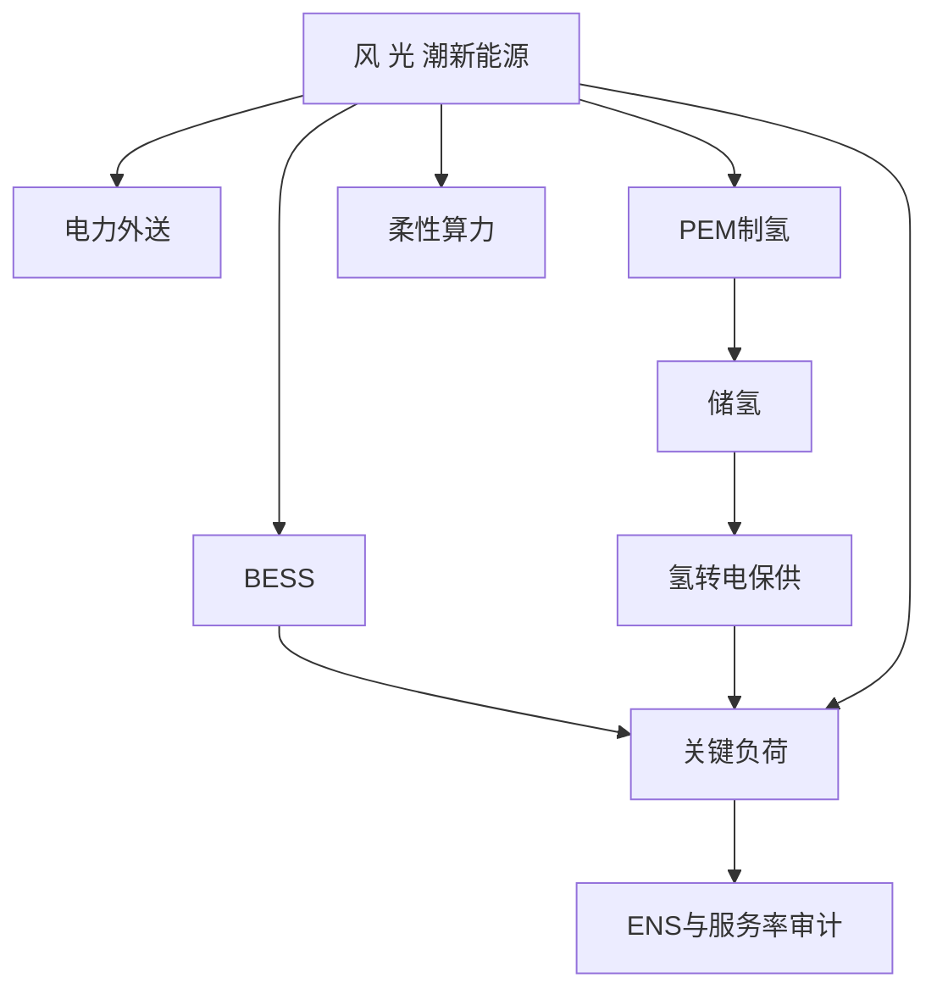

# 第五章 方案验证与运营分析报告

> 口径声明：本章只分析当前仓库内 C5 有效仿真结果，不将仿真结果直接解释为可研概算、融资承诺、投资收益承诺或设备性能保证。电力外送价、氢价和算力服务价采用公开市场代理锚值，不是项目合同价；海洋服务价仍为 **[假设值，待企业调研校准]**。除明确标注公开来源的数据外，容量、任务池、设备可用率、极端事件和控制参数均属于 **[假设值，待企业调研校准]**。仿真输出均为 **[模型仿真输出；输入含政府公开数据与假设参数]**。

## 5.1 场景设计与数据来源

本章场景层回答两个问题：第一，模型每个小时读入什么；第二，48 h 短场景和 8,760 h 年度场景分别怎么构造。当前有效短窗是 48 h，不是 168 h 典型周；若后续需要“典型周”，应另行选取或生成 168 h 场景并重跑。

### 5.1.1 输入数据结构

调度模型的输入分为资源、设备、负荷、市场、状态和事件六类：

| 输入类别 | 主要字段 | 当前来源或口径 | 状态 |
|---|---|---|---|
| 源侧资源 | 风速、辐照度、气温、潮流速度 | NASA POWER 小时风速/辐照度/气温；潮流速度由内部形状扩展 | NASA 为 **[政府官网/政府科研机构公开数据]**；潮流为 **[假设值，待企业调研校准]** |
| 设备容量 | 风电、海缆、BESS、PEM、电氢转换、算力设施 | C4/V5 配置与 C5 场景参数 | **[假设值，待企业调研校准]** |
| 负荷需求 | 海洋关键负荷、柔性算力任务池 | C5 场景构造器 | **[假设值，待企业调研校准]** |
| 市场价格 | 电力外送价、氢价、算力服务价、海洋服务价 | 电力、氢和算力采用公开市场代理锚值；海洋服务价为待校准假设值 | 电/氢/算力为公开代理锚值，海洋服务价为假设值；均非项目合同价 |
| 初始状态 | BESS 初始电量、氢库存、电解槽状态、算力状态 | 年度从 BESS 80 MWh、氢库存 0 kg 开始 | 不在事件前外部注入 SOC 或氢 |
| 极端事件 | 台风预警、过境、恢复状态，设备降额 | 年度代理事件 | **[假设值，待企业调研校准]**，不是历史事件复刻 |

比较场景中的算力全部按可中断柔性负荷处理，`pComputeBaseDemandMW=0`，未执行算力不计入刚性 ENS。若后续企业合同存在不可中断 SLA，应单独设刚性算力敏感性场景，不能与本章主比较口径混用。

### 5.1.2 48 h 场景设计

48 h 场景有两个用途，不能混在一起：

| 48 h 场景 | 构造方式 | 用途 | 是否参与方案排名 |
|---|---|---|---|
| 机制验证 48 h | `c5_build_all_channel_48h_scenario.m` 合成多阶段压力过程 | 验证风、光、潮接口，BESS/H2 状态转移，海缆、制氢、算力、海洋负荷通道和 V5 代数审计 | 否 |
| 正常典型 48 h | `c5_select_typical_normal_48h.m` 从年度正常候选窗口中离线选取 | 比较纯电、纯氢、纯算和在线混合策略 | 是 |

机制验证 48 h 通过分阶段构造低出力、升出力、电价窗口、氢价窗口、算力窗口、海缆拥塞、BESS 回补和恢复过程，目的是让所有出口和状态变量都被触发。该场景只证明模型链路能闭合，不参加经济性和方案最优排序。

正常典型 48 h 从年度场景中按“候选窗口相对正常状态中位特征向量的 MAD 距离最小”选出。当前窗口为 2025-01-24 00:00 至 2025-01-25 23:00 UTC，全部为 `NORMAL` 状态。窗口选择属于离线评价设计，不把窗口之后的真实源侧出力提供给在线策略。

### 5.1.3 年度 8,760 h 场景设计

年度场景由 `c5_build_annual_2025_multisource_scenario.m` 生成 8,760 h 风、光、潮可用功率。风、光、潮发电量由 4.3 设备模型和逐时资源条件计算，不预先固定年度总发电量。年度中嵌入 12 h 台风预警、24 h 台风过境和 24 h 恢复代理事件。

年度运行遵守以下因果边界：

1. 每小时只继承上一小时末 BESS、氢库存、电解槽、算力和氢转电状态；
2. 计划窗口只执行首小时；
3. 源侧未来真实出力不进入计划；
4. 台风事件前不重置 SOC、不额外注入氢；
5. 氢库存只有物理非负约束，不设置运营储备下限；
6. BESS 储备目标是可回退调度约束，不是模型外补能。

系统能量流如下：



## 5.2 基准方案设计：单一电力、氢与算力外送

三类基准方案通过资产开关形成，不再使用 22 种固定 E/H/C 比例方案。基准方案共同保留源侧新能源、BESS 和海洋关键负荷，只改变可选产品出口。

| 基准方案 | 打开的可选产品通道 | 关闭的可选产品通道 | 设计目的 |
|---|---|---|---|
| 纯电资产基准 | 海缆外送 | 制氢、柔性算力 | 检验新能源直接外送电力的消纳和收益能力 |
| 纯氢资产基准 | PEM 制氢、储氢、氢输出 | 海缆外送、柔性算力 | 检验氢链条在单一出口边界下是否承接波动电量 |
| 纯算资产基准 | 柔性算力 | 海缆外送、制氢 | 检验可中断算力负荷的吸纳和变现能力 |

基准方案不是固定比例分配，也不强制可用新能源必须进入对应产品。模型仍按可靠性和经济性优化：如果纯氢基准中制氢不经济，电解槽可以不启动；如果纯算基准中任务池不足，剩余新能源可以弃电。因此，基准结果应解释为“资产开关边界下的最优调度结果”，不能写成“强制全电、全氢、全算”。

当前有效横向比较只引用正常典型 48 h 结果。年度基准目前只落盘纯电资产基准一条，不能写成“三大基准年度比较已完成”。

## 5.3 对比方案与最优策略设计

对比方案由储能、制氢、算力和混合模式组成。本节只写方案和策略怎么设计，结果统一放到 5.4。

### 5.3.1 储能调度设计

BESS 用于短时平滑、关键负荷保供和调度备用。调度时记录充电、放电、SOC、储备目标和储备目标回退。BESS 储备目标不是硬性保供承诺，当其与当前小时零 ENS 冲突时，可以释放储备目标，优先满足当前关键负荷。

### 5.3.2 制氢与氢转电设计

制氢链条包括 PEM 制氢、储氢、氢交付和氢转电。制氢是可选产品出口，氢转电是保供通道。当前年度主账氢库存不设置运营下限，只受物理非负和容量约束；这能避免模型外注入氢，但也意味着台风事件前未必自然形成足够氢库存。

### 5.3.3 柔性算力设计

算力在本章主比较中全部作为可中断柔性负荷处理，不计入刚性 ENS。算力设施的主要作用不是全年消耗最多电量，而是在任务池和服务价格允许时提供较高单位电量变现能力。若未来承诺刚性 SLA，则应另设刚性算力负荷和违约惩罚场景。

### 5.3.4 在线混合最优策略

在线混合策略同时启用电力外送、制氢和柔性算力。每小时用截至上一小时的风、光、潮实测形成先验，再用动态后验修正源侧可用功率估计，在 6 h 滚动窗口内生成 E/H/C 计划，并只执行当前首小时。

结算层采用可靠性优先的分层逻辑：

1. 先同时满足当前小时 `ENS=0`、计划份额和因果 SOC 储备目标；
2. 若不可行，释放可选产品计划份额；
3. 若仍不可行，释放 BESS/氢储备目标；
4. 若物理边界仍不能零 ENS，则先求该小时最小 ENS，并在最小 ENS 容差内优化经济性。

份额计划经过指数平滑、死区保持和小时变化限幅，避免 E/H/C 分配在相邻小时剧烈抖动。卡尔曼递推、协方差交集和防抖参数均用于在线策略，但噪声比例、CI 权重、死区和限幅仍为 **[假设值，待企业调研校准]**。


## 5.4 典型场景调度结果：48 h 与 8,760 h

本节只列原始仿真结果，不做二次加工判断。经济性、弃电率、碳减排和稳定性统一放到 5.5。

### 5.4.1 正常典型 48 h 四方案结果

四方案使用同一 48 h 正常窗口，可用新能源均为 8,450.799 MWh，均 `auditPass=true`、`allHoursOptimal=true`、ENS 为 0。

| 方案 | 新能源利用/MWh | 弃能/MWh | 消纳率 | 现金运行毛收益/百万元 | 净运营价值/百万元 | ENS/MWh |
|---|---:|---:|---:|---:|---:|---:|
| 纯电资产基准 | 7,663.692 | 787.107 | 90.686% | 2.533 | 2.558 | 0 |
| 纯氢资产基准 | 1,090.276 | 7,360.523 | 12.901% | 0.237 | 0.263 | 0 |
| 纯算资产基准 | 2,317.100 | 6,133.699 | 27.419% | 5.954 | 5.979 | 0 |
| 在线混合策略 | 8,178.669 | 272.130 | 96.780% | 6.756 | 8.038 | 0 |

分产品调度结果如下：

| 方案 | 电力外送输入/MWh | 制氢输入/MWh | 柔性算力输入/MWh | 算力服务/MWh-CS | 产氢/kg | 海缆受端电量/MWh |
|---|---:|---:|---:|---:|---:|---:|
| 纯电资产基准 | 6,573.416 | 0.000 | 0.000 | 0.000 | 0.000 | 6,047.543 |
| 纯氢资产基准 | 0.000 | 0.000 | 0.000 | 0.000 | 0.000 | 0.000 |
| 纯算资产基准 | 0.000 | 0.000 | 1,226.824 | 1,148.243 | 0.000 | 0.000 |
| 在线混合策略 | 3,343.839 | 2,515.438 | 1,226.824 | 1,148.243 | 44,309.278 | 3,076.332 |

在线混合策略的实际可选投入比例为 47.189% / 35.498% / 17.313%，分别对应电力外送、制氢和柔性算力。其 48 h 富余再调度触发 2 h，额外吸收 64.586 MWh 进入制氢。

### 5.4.2 年度 8,760 h 结果

年度有效结果分两类：年度纯电基准和年度在线混合策略。年度纯氢和纯算基准尚未补齐，因此不能形成年度三基准完整横向比较。

| 指标 | 年度纯电基准 | 年度在线混合策略 |
|---|---:|---:|
| 可用新能源/MWh | 2,014,114.533 | 2,014,114.533 |
| 新能源利用/MWh | 1,211,294.279 | 1,508,548.282 |
| 新能源利用率 | 60.140% | 74.899% |
| 弃能/MWh | 802,820.255 | 505,566.251 |
| ENS/MWh | 2,544.630 | 2,248.455 |
| 关键负荷服务率 | 98.638% | 98.796% |
| 电力外送投入/MWh | 1,026,111.830 | 801,813.764 |
| 制氢投入/MWh | 0.000 | 346,498.437 |
| 柔性算力投入/MWh | 0.000 | 201,297.895 |
| 产氢量/kg | 0.000 | 6,103,548.301 |
| 氢交付量/kg | 0.000 | 4,403,964.483 |
| 算力服务量/MWh-CS | 0.000 | 187,398.643 |
| 已实现输出收入/百万元 | 425.458 | 1,404.611 |
| 运行成本/百万元 | 55.635 | 92.142 |
| 现金运行毛收益/百万元 | 369.822 | 1,312.468 |

年度极端事件分相如下，表中为年度在线混合策略主账结果：

| 阶段 | 小时 | 可用新能源/MWh | 利用/MWh | 制氢投入/MWh | ENS/MWh | 最低 SOC | 最低氢库存/kg | 计划回退/h | 储备回退/h |
|---|---:|---:|---:|---:|---:|---:|---:|---:|---:|
| 正常 | 8,700 | 2,005,898.940 | 1,504,753.903 | 345,658.437 | 1,890.907 | 0.10625 | 0 | 352 | 294 |
| 预警 | 12 | 1,473.472 | 374.121 | 0 | 0 | 0.40787 | 0 | 0 | 2 |
| 过境 | 24 | 0 | 0 | 0 | 341.340 | 0.10625 | 0 | 0 | 18 |
| 恢复 | 24 | 6,742.121 | 3,420.258 | 840.000 | 16.209 | 0.10625 | 0 | 7 | 2 |

## 5.5 经济性、弃电率、碳减排和稳定性对比

本节对 5.4 的直接结果做派生分析。除特别说明外，经济指标仍不含完整 CAPEX、固定运维、替换、税费和融资。

### 5.5.1 经济性加工

48 h 短场景中，四方案均 ENS 为 0，因此经济性和消纳能力成为主要区分项。在线混合策略现金运行毛收益为 6.756 百万元，高于纯算的 5.954 百万元和纯电的 2.533 百万元；纯氢仅为 0.237 百万元。

年度结果中，在线混合策略相对年度纯电基准增加现金运行毛收益 942.646 百万元。也就是说，年度混合策略证明了运行层现金毛收益。

### 5.5.2 弃电率加工

| 场景 | 方案 | 弃能/MWh | 弃电率 |
|---|---|---:|---:|
| 48 h | 纯电资产基准 | 787.107 | 9.314% |
| 48 h | 纯氢资产基准 | 7,360.523 | 87.099% |
| 48 h | 纯算资产基准 | 6,133.699 | 72.581% |
| 48 h | 在线混合策略 | 272.130 | 3.220% |
| 8,760 h | 年度纯电基准 | 802,820.255 | 39.860% |
| 8,760 h | 年度在线混合策略 | 505,566.251 | 25.101% |

48 h 中，在线混合策略弃电率最低，说明多出口协同在正常短窗内能最大化吸收新能源。年度中，在线混合策略相对纯电基准降低弃能 297,254.003 MWh，弃电率下降 14.759 个百分点。

### 5.5.3 碳减排代理指标

当前结果 CSV 未直接落盘完整 `netGHGKgCO2e`，本节按 V5 默认环境参数派生可比代理指标。计算口径为：

```text
项目排放代理 = 15 kgCO2e/MWh * 新能源利用量
             + 5 kgCO2e/MWh * BESS充放电吞吐量
避免排放代理 = 500 kgCO2e/MWh * 海缆受端电量
             + 10 kgCO2e/kg * 氢交付量
             + 500 kgCO2e/MWh-CS * 算力服务量
净碳代理 = 项目排放代理 - 避免排放代理
```

该口径暂不含海洋服务常数项，也不是产品 LCA 或碳足迹认证；它只用于同一模型边界下的相对比较。

| 场景 | 方案 | 项目排放代理/tCO2e | 避免排放代理/tCO2e | 净碳代理/tCO2e |
|---|---|---:|---:|---:|
| 48 h | 纯电资产基准 | 115.287 | 3,023.771 | -2,908.484 |
| 48 h | 纯氢资产基准 | 16.686 | 0.000 | 16.686 |
| 48 h | 纯算资产基准 | 35.088 | 574.122 | -539.034 |
| 48 h | 在线混合策略 | 123.235 | 2,112.287 | -1,989.052 |
| 8,760 h | 年度纯电基准 | 18,255.419 | 472,011.442 | -453,756.023 |
| 8,760 h | 年度在线混合策略 | 22,744.345 | 506,573.298 | -483,828.953 |

48 h 短窗中，纯电基准的净碳代理最优，因为该窗口内直接电力外送量高，且纯电路线没有制氢和算力额外消纳。年度口径下，在线混合策略的净碳代理优于年度纯电，原因是年度长周期内多产品交付带来的避免排放项更大。由此可见，碳减排排序不能只看一个短窗，应以年度连续结果为主。

### 5.5.4 稳定性与可靠性加工

| 场景 | 方案 | ENS/MWh | 运行状态 | 计划回退/h | 储备回退/h | 可靠性层级/h | 稳定性判断 |
|---|---|---:|---|---:|---:|---:|---|
| 48 h | 四方案 | 0 | `PASS_STRICT` | 0 | 0 | 0 | 短窗严格通过 |
| 8,760 h | 年度纯电基准 | 2,544.630 | `PASS_RELAXED` | 0 | 0 | 188 | 年度可靠性未严格达标 |
| 8,760 h | 年度在线混合策略 | 2,248.455 | `PASS_RELAXED` | 359 | 316 | 154 | 可因果运行，但存在计划和储备回退 |

年度在线混合策略 8,760/8,760 h 求解最优且通过代数审计，平均计划份额 L1 小时变化 0.0632，最大 L1 变化 0.20，死区保持 2,497 h，说明防抖逻辑有效。但全年状态仍为 `PASS_RELAXED`，不能写成年度零 ENS 或严格保供达标。

## 5.6 离岸距离、电价、氢价与算力价格敏感性分析

本节改为“固定调度后处理 + 少量边界重跑”的最小重跑口径。电价、氢价、算力价格先用年度在线策略 8,760 h 结果直接重定价；设备成本和海缆成本按 4.2/4.8 生命周期台账重算，不重解调度；柔性比例和海缆损耗只保留边界重跑清单，默认不执行。结果底稿位于 `C5/5.7混合最优策略短测试与年度运营分析/results/minimal_sensitivity_5_6/`，包括 `c5_56_price_slope.csv`、`c5_56_fixed_dispatch_price_sensitivity.csv`、`c5_56_fixed_dispatch_cost_sensitivity.csv`、`c5_56_boundary_rerun_manifest.csv` 和 `c5_56_minimal_sensitivity_report.md`。

### 5.6.1 离岸距离敏感性

离岸距离在当前最小重跑里先作为海缆/海纤 CAPEX 的投资口径代理。基准 200 km 对应年化投资负担 3,670.660 百万元；100 km 和 300 km 分别对应 3,596.987 百万元和 3,744.333 百万元。这个结果只反映资本项变化，不包含海缆损耗和可用率对调度的二阶影响；后者需按 `distance_loss_proxy_0p05` 和 `distance_loss_proxy_0p12` 边界清单单独重跑。

### 5.6.2 电价、氢价和算力价格线性敏感度

以下为固定当前年度调度结果时的收入斜率，不代表重新优化后的结果。价格提高 10 CNY/MWh、1 CNY/kg、100 CNY/MWh-CS 时，年度收入分别增加 7.377 百万元、4.404 百万元和 18.740 百万元。`ENS`、回退小时数和 GHG 均保持不变，因为这里没有重解调度。

### 5.6.3 敏感性结论

1. 算力价格仍是当前年度在线策略的最大收入杠杆。
2. 电价和氢价可以先做固定调度重估，快速判断收益弹性。
3. 设备成本和海缆成本应走生命周期台账，不要重复重解全年调度。
4. 柔性比例和海缆损耗属于会改变可行域的参数，只在边界清单里挑少数全年重跑。
## 5.7 本章仿真结论

1. 48 h 机制验证场景只用于接口、状态转移和代数审计，不参与方案排名。
2. 正常典型 48 h 中，在线混合策略消纳率 96.780%、弃能 272.130 MWh、现金运行毛收益 6.756 百万元，综合表现最优。
3. 三类单一出口基准各有作用：纯电短窗消纳率高，纯算单位电量变现能力强，纯氢在当前 1 h 控制下没有启动制氢，不能直接否定氢资产价值。
4. 年度在线混合策略相对年度纯电基准提高消纳率 14.759 个百分点，减少弃能 297,254.003 MWh，增加现金运行毛收益 942.646 百万元。
5. 年度在线混合策略 8,760 h 均求解最优并通过代数审计，但状态为 `PASS_RELAXED`，仍有 2,248.455 MWh ENS，不能写成年度严格零缺供。
6. 台风代理事件过境期源侧为 0，年度主账出现 341.340 MWh ENS，当前结果不能证明 24 h 零源出力下自然储氢保供达标。
7. 经济性和可靠性必须分开验收：经济性靠轻资产、合同化和分期建设；可靠性靠 BESS、储氢、氢转电或外部备用重新定容并重跑年度仿真。
8. 敏感性分析已拆成固定调度重定价、生命周期台账重算和少量边界全年重跑三层；价格与成本已落盘，柔性比例和海缆损耗的全年重跑按清单单独执行。
9. 项目层收益分析留到下一章展开。

## 证据文件

- `C5/5.1场景设计/5.1场景设计.md`
- `C5/5.2三大基准方案/5.2三大基准方案.md`
- `C5/5.3对比方案与模型最优策略/5.3对比方案与最优策略推导.md`
- `C5/5.3对比方案与模型最优策略/results/typical_normal_48h_four_strategy/c5_typical48_four_strategy_summary.csv`
- `C5/5.3对比方案与模型最优策略/results/typical_normal_48h_four_strategy/c5_typical48_four_strategy_hourly.csv`
- `C5/5.2三大基准方案/results/annual_asset_baselines_causal/c5_annual_four_strategy_summary.csv`
- `C5/5.2三大基准方案/results/annual_asset_baselines_causal/c5_annual_four_strategy_hourly.csv`
- `C5/5.7混合最优策略短测试与年度运营分析/5.7混合最优策略与年度运营分析.md`
- `C5/5.7混合最优策略短测试与年度运营分析/results/annual_8760h_online_strategy_extreme/c5_annual_online_strategy_summary.csv`
- `C5/5.7混合最优策略短测试与年度运营分析/results/annual_8760h_online_strategy_extreme/c5_annual_online_strategy_event_summary.csv`
- `C5/5.7混合最优策略短测试与年度运营分析/results/annual_8760h_online_strategy_extreme/c5_annual_online_strategy_hourly.csv`
- `C5/5.7混合最优策略短测试与年度运营分析/results/minimal_sensitivity_5_6/c5_56_minimal_sensitivity_report.md`
- `C5/5.7混合最优策略短测试与年度运营分析/results/minimal_sensitivity_5_6/c5_56_fixed_dispatch_price_sensitivity.csv`
- `C5/5.7混合最优策略短测试与年度运营分析/results/minimal_sensitivity_5_6/c5_56_fixed_dispatch_cost_sensitivity.csv`
- `C5/5.7混合最优策略短测试与年度运营分析/results/minimal_sensitivity_5_6/c5_56_boundary_rerun_manifest.csv`